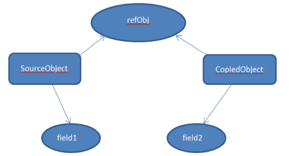

# <center>Advanced Java Knowledge</center>

<br></br>


## Using Reflection in Frameworks
----
Why use reflection in JUNIT, Spring, Tomcat, Struts and Hibernate? but not for normal programming?

Because frameworks have no knowledge and access of user defined classes, interfaces, their methods etc. Using reflection we can inspect a class, interface and enum get their structure, methods and fields information at runtime even though class is not accessible at compile time. We can also use reflection to instantiate an object, invoke it’s methods, change field values.

We should not use reflection in normal programming interfaces because:
* Poor Performance – Since reflection resolve the types dynamically, it involves processing like scanning the classpath to find the class to load, causing slow performance.反射包括了一些动态类型，所以JVM无法对这些代码进行优化。
* Security Restrictions – Reflection requires runtime permissions that might not be available for system running under security manager. This can cause you application to fail at runtime because of security manager.
* Security Issues – Using reflection we can access part of code that we are not supposed to access, for example we can access private fields of a class and change its value. This can be a serious security threat and cause your application to behave abnormally.
* High Maintenance – Reflection code is hard to understand and debug, also any issues with the code can’t be found at compile time because the classes might not be available, making it less flexible and hard to maintain.

<br></br>


## 1. List中的迭代器
```java
private class Itr implements Iterator<E> {
        int cursor = 0;
        int lastRet = -1;
        int expectedModCount = modCount;

        public boolean hasNext() {
            return cursor != size();
        }

        public E next() {
            checkForComodification();
            try {
                int i = cursor;
                E next = get(i);
                lastRet = i;
                cursor = i + 1;
                return next;
            } catch (IndexOutOfBoundsException e) {
                checkForComodification();
                throw new NoSuchElementException();
            }
        }

        public void remove() {
            if (lastRet < 0)
                throw new IllegalStateException();
            checkForComodification();

            try {
                AbstractList.this.remove(lastRet);
                if (lastRet < cursor)
                    cursor--;
                lastRet = -1;
                expectedModCount = modCount;
            } catch (IndexOutOfBoundsException e) {
                throw new ConcurrentModificationException();
            }
        }

        final void checkForComodification() {
            if (modCount != expectedModCount)
                throw new ConcurrentModificationException();
        }
}
```


## 2. super()与继承问题
```java
class Aa {
    public Aa(String a,String b) { 
    }
}
 
public class Bb extends Aa {
    public Bb(String a,String b) {
    //隐掉下面那句话后在此构造函数处提示：Implicit super constructor Aa() is undefined.
    //Must explicitly invoke another constructor
    //或者在父类显示写一个不带参数的构造函数
        super(a,b);
    } 
}
```

&#12288;&#12288;子类的构造方法如果没明确调用父类构造方法,会默认调用父类不带参数的构造方法。如果父类有定义带参数构造方法但没定义不带参数的构造方法,则不会默认创建不带参数的构造方法。这样子类调用就出错。

<br></br>


## 4. Comparable vs Comparator
### 4.1 Comparable 定义在 Person类的内部

`public class Persion implements Comparable {..比较Person的大小..}`,
`Collections.sort(personList)`可以得到正确的结果。


### 4.2 Comparator 定义在Person外部
&#12288;&#12288;此时`Person`类结构不需要有任何变化,如
`public class Person{ String name; int age }`

&#12288;&#12288;然后另外定义一个比较器:
`public PersonComparator implements Comparator() {..比较Person的大小..}`

&#12288;&#12288;当要对`personList`排序时, 除了要传递`personList`, 还要把`PersonComparator`传过去, 如:

`Collections.sort( personList , new PersonComparator() )`


### 4.3 Comparable example
```java
public class PersonComparable implements Comparable<PersonComparable>{
    private int age;
    private String name;
    
    public int compareTo(PersonComparable another) {
        if(another != null){
            return age - another.getAge();
        }else{
            throw new NullPointerException();
        }
   }
}

public static void main(String[] args) {
        PersonComparable[] pArr = new PersonComparable[2];
        pArr[0] = new PersonComparable("test1", 26);
        pArr[1] = new PersonComparable("test2", 19);
        
        Arrays.sort(pArr);
}
```

### 4.4 Comparator example
```java
public class PersonComparator implements Comparator<Person>{
    public int compare(Person p1, Person p2){
        if(p1 != null && p2 != null){
            return p1.getAge() - p2.getAge();
        }else{
            throw new NullPointerException();
        }
    }
}

public static void main(String[] args) {
        Person[] pArr = new Person[2];
        pArr[0] = new Person("test1", 26);
        pArr[1] = new Person("test2", 19);
        Arrays.sort(pArr, new PersonComparator());
}
```


## 5. Go vs Java
### 5.1 并发
&#12288;&#12288;首先，go提供goroutine作为原生的并发机制。每个goroutine所需的内存很少，实际应用中可以启动大量的goroutine对并发连接进行响应。goroutine遇到IO阻塞，调度器会自动切换到另一个goroutine执行，保证CPU不会因为IO而发生等待。
&#12288;&#12288;同时，go为goroutine提供了独到的通信机制——channel。channel发生读写的时候，会挂起当前操作channel的goroutine，是一种同步阻塞通信。这样既达到了通信的目的，又实现同步。
&#12288;&#12288;进行网游开发的程序员，可以将游戏逻辑按照单线程阻塞式的写，不需要额外考虑线程调度的问题，以及线程间数据依赖的问题。因为，线程间的channel通信，已经表达了线程间的数据依赖关系了，而go的调度器会给予妥善的处理。

### 5.2 编译
&#12288;&#12288;google go编译器和标准库总共近70万行go和汇编代码（包括测试代码则是过100万行），编译一次，在普通机器上耗时不到2分钟。

### 5.3 缺陷
&#12288;&#12288;Go语言比较新，学习成本和用人成本高；强类型转换。

### 5.4 其它：
* Go提供了闭包和Map，都是Go内建数据结构。
* 包管理，用go get <github地址>就能安装一个包或者一个命令，自动下载所有依赖
* defer 是个很好的想法，try ... finally 的升级版，更加灵活，可以更容易的让资源的分配与释放代码放在一起。
* 云服务。在国内写了一个网络应用，上传到国内服务器上，这时，巴西想用一下这个网络应用，他需要通过网络把请求发到国内服务器，然后原路返回，延迟巨大而且缺乏稳定性。一种解决方案是，把go原代码直接上传，巴西想用，通过网络，将源代码下载到巴西那里的服务器节点，编译链接生成应用，相当于直接在他国内使用，网络环境好了很多。但是，国内的服务器是windows server2008 64bit，巴西用的是freebsd 32bit，没关系go跨平台。但是，要用这个软件算几个矩阵乘法的最优解1分钟之内就应该解决，不会要让我等2-3分钟的编译时间吧，不会的，下载加编译，一共5秒，你还没刷新，我就编好了。


## 6. Regular Expression


## 7. Shallow Copy vs Deep Copy
### 7.1 Shallow Copy



&#12288;&#12288;浅拷贝是按位拷贝对象，会创建一个新对象。如果原始对象属性是基本类型，拷贝的就是基本类型的值；如果原始对象属性是内存地址（引用类型），拷贝的就是内存地址 ，因此如果其中一个对象改变了这个地址，就会影响到另一个对象。
&#12288;&#12288;图中，`SourceObject`有一个int类型的属性 `field1`和一个引用类型属性`refObj`。对`SourceObject`浅拷贝时，创建了`CopiedObject`。由于`field1`是基本类型，所以将它的值拷贝给`field2`，但由于`refObj`是引用类型, 所以`CopiedObject`指向`refObj`相同的地址。因此对`SourceObject`中的`refObj`所做的任何改变都会影响到`CopiedObject`。


### 7.2 Example of Shallow Copy
```java
public class Subject {
    private String name; 

    public Subject(String s) { 
      name = s; 
   } 
}

public class Student implements Cloneable { 
   private Subject subj;  // 对象引用
   private String name; 

   public Student(String s, String sub) { 
      name = s; 
      subj = new Subject(sub); 
   } 

   // 重写clone()方法, 浅拷贝
   public Object clone() { 
      try { 
         return super.clone();  // 直接调用父类的clone()方法
      } catch (CloneNotSupportedException e) { 
         return null; 
      } 
   } 
}
```

### 7.3 Deep Copy
&#12288;&#12288;深拷贝会拷贝所有的属性,并拷贝属性指向的动态分配的内存。当对象和它所引用的对象一起拷贝时即发生深拷贝。深拷贝相比于浅拷贝速度较慢并且花销较大。


### 7.4 Example of Deep Copy
```java
public class Student implements Cloneable { 
   private Subject subj;  // 对象引用 
   private String name; 

   public Student(String s, String sub) { 
      name = s; 
      subj = new Subject(sub); 
   } 

   // 重写clone()方法 
   public Object clone() { 
      // 深拷贝，创建拷贝类的一个新对象，这样就和原始对象相互独立
      Student s = new Student(name, subj.getName()); 
      return s; 
   } 
}
```


### 7.5 通过序列化深拷贝
&#12288;&#12288;请注意，通过序列化进行深拷贝时，必须确保对象图中所有类都是可序列化的。
```java
public class ColoredCircle implements Serializable { 
   private int x; 
   private int y; 

   public ColoredCircle(int x, int y) { 
      this.x = x; 
      this.y = y; 
   } 
}

public class DeepCopy {
   public static void main(String[] args) throws IOException { 
      ObjectOutputStream oos = null; 
      ObjectInputStream ois = null; 

      try { 
         ColoredCircle c1 = new ColoredCircle(100, 100);  // 创建原始的可序列化对象 
         ColoredCircle c2 = null; 

         // 通过序列化实现深拷贝 
         ByteArrayOutputStream bos = new ByteArrayOutputStream(); 
         oos = new ObjectOutputStream(bos); 

         // 序列化以及传递这个对象 
         oos.writeObject(c1); 
         oos.flush(); 
         ByteArrayInputStream bin = new ByteArrayInputStream(bos.toByteArray()); 
         ois = new ObjectInputStream(bin); 

         // 返回新的对象 
         c2 = (ColoredCircle) ois.readObject(); 
} catch (Exception e) { 
         System.out.println("Exception in main = " + e); 
      } finally { 
         oos.close(); 
         ois.close(); 
      } 
   } 
}
```


### 7.5 延迟拷贝
&#12288;&#12288;是浅拷贝和深拷贝的组合。当最开始拷贝一个对象时，会使用速度较快的浅拷贝，还会用计数器记录有多少对象共享这个数据。当程序想要修改原始的对象时，它会决定数据是否被共享（通过检查计数器）并根据需要进行深拷贝。 
&#12288;&#12288;延迟拷贝从外面看起来就是深拷贝，但是只要有可能它就会利用浅拷贝的速度。当原始对象中的引用不经常改变的时候可以使用延迟拷贝。由于存在计数器，效率下降很高，但只是常量级的开销。而且, 在某些情况下, 循环引用会导致一些问题。


## 8. StringBuilder, StringBuffer底层原理
&#12288;&#12288;都继承自AbstractStringBuilder这个类，底层都是char数组操作，StringBuffer之所以线程安全是所有方法都加了Synchronized


## 9. 求String输出结果
### 9.1 Case I
```java
public static void main(String[] args) {
    String str1 = "hello world";
    String str2 = new String("hellop world");
    String str3 = "hello world";
    String str4 = new String("hello world");

    System.out.println(str1 == str2);
    System.out.println(str1 == str3);
    System.out.println(str4 == str2);
}
```

Output:
> false, true, false

&#12288;&#12288;`str1`和`str3`都在编译期间生成了字面常量和符号引用，运行期间字面常量"hello world"被存储在运行时常量池。通过这种方式来将String对象跟引用绑定的话，JVM会先在运行时常量池查找是否存在相同的字面常量，如果存在，则直接将引用指向已经存在的字面常量；否则在运行时常量池开辟一个空间来存储该字面常量，并将引用指向该字面常量。

&#12288;&#12288;通过new关键字来生成对象是在堆进行的，而在堆对象生成的过程是不会去检测该对象是否已存在的。因此通过new来创建对象，创建出的一定是不同的对象，即使字符串的内容是相同的。


### 9.2 Case II
```java
String a = "hello2"; 　　
String b = "hello" + 2; 　　
System.out.println((a == b));
```

&#12288;&#12288;true。`b`在编译期间就已经被优化成"hello2"，因此在运行期间，变量`a`和变量`b`指向的是同一个对象。

### 9.3 Case III
```java
String a = "hello2"; 
String b = "hello";    
String c = b + 2;     
System.out.println((a == c));
```

&#12288;&#12288;false。由于有符号引用的存在，所以`c`不会在编译期间被优化，不会把`b + 2`当做字面常量来处理的，因此生成的对象是保存在堆上的。


### 9.4 Case IV
```java
String a = "hello2"; 
final String b = "hello"; 
String c = b + 2; 
System.out.println((a == c));
```

&#12288;&#12288;true。被`final`修饰的变量，会在class文件常量池中保存一个副本，不会通过连接而进行访问。对`final`变量的访问在编译期间都会直接被替代为真实的值。那么`String c = b + 2`在编译期间就会被优化成`String c = "hello" + 2`。


### 9.5 Case V
```java
 String a = "hello2"; 
 final String b = getHello(); 
 String c = b + 2;   
 System.out.println((a == c));
 ```
&#12288;&#12288;false。虽然`b`用`final`修饰，但由于其赋值是通过方法调用返回的，那么它的值只能在运行期间确定，因此`a`和`c`指向的不是同一个对象。


