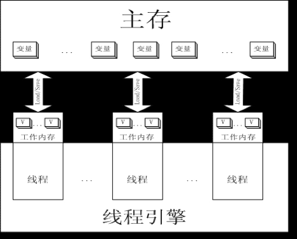

# <center>Concurrent Conclusion</center>


## 1. 线程的五个状态wait和sleep区别：


1. 新建(new)：新创建了一个线程对象。
2. 可运行(runnable)：线程对象创建后，其他线程调用了该对象的`start()`，该状态的线程位于可运行线程池中，等待被线程调度选中，获取cpu使用权 。
3. 运行(running)：可运行状态(runnable)的线程获得了cpu时间片（timeslice），执行程序。
4. 阻塞(block)：线程因为某种原因放弃了cpu使用权，暂时停止运行，阻塞的情况分三种： 
    1. 等待阻塞：运行的线程执行`wait()`，JVM把该线程放入等待队列(waitting queue)中。
    2. 同步阻塞：运行的线程在获取对象同步锁时，若该同步锁被别的线程占用，则JVM会把该线程放入锁池(lock pool)中。
    3. 其他阻塞：运行的线程执行`Thread.sleep(long ms)`或`t.join()`，或者发出I/O请求时，JVM会把该线程置为阻塞状态。当`sleep()`状态超时、`join()`等待线程终止或者超时、或者I/O处理完毕时，线程重新转入可运行(runnable)状态。
5. 死亡(dead)：线程`run()`、`main() `方法执行结束，或者因异常退出了`run()`，则该线程结束生命周期。

&#12288;&#12288;`wait()`与`sleep()`区别：
* `wait()是`Object`方法，而`sleep()`是`Thread`类的静态方法
*  `sleep()`使线程阻塞指定时间，这段时间当前线程让出CPU时间，时间结束后继续执行，该过程不释放线程持有的对象锁；`wait()`调用后线程释放持有的锁并进入该锁等待队列，当收到持有锁的其它线程`notify()`或`notifyAll()`信号后，`wait()`方法返回。

&#12288;&#12288;`run()`与`start()`区别：
* 用`start()`启动无需等待`run()`执行完毕而直接继续执行下面的代码。通过调用`Thread`类的`start()`启动线程，这时此线程处于就绪状态，并没有运行，一旦得到时间片就开始执行`run()`。
* `run()`只是类的一个普通方法，如果直接调用`run()`，程序中依然只有主线程这一个线程，其程序执行路径还是只有一条，还是要顺序执行，还是要等待`run()`方法体执行完毕后才可继续执行下面的代码，这样就没有达到写线程的目的。

<br></br>


## 2. 常用数据结构原理
### 2.1 AtomicInteger, AtomicBoolean & AtomicLong
&#12288;&#12288;基于**CAS**，是**乐观锁**。

<br>


### 2.2 ConcurrentHashMap
&#12288;&#12288;JDK 1.8前基于**segment的lock**，JDK1.8是对node使用了`volatile`保证读的**happens-before**。在写数据时，如果是新的结点，使用**CAS**，其它则用**synchronized**。

<br>


### 2.3 BlockingQuque
&#12288;&#12288;原理：
* ArrayBlockingQueue是一个由数组支持的有界阻塞队列。 创建时默认非公平锁，不过可在它的构造函数里指定,因为调用ReentrantLock的构造函数创建锁。
* SynchronousQueue同步队列没有任何内部容量。不能在同步队列上进行`peek()`，因为仅在试图要取得元素时，该元素才存在；除非另一个线程试图移除某个元素，否则也不能使用任何方法添加元素；也不能迭代队列，因为其中没有元素可用于迭代。
* LinkedBlockingQueue是一个基于已链接节点的、范围任意的blocking queue。队列的头部是在队列中时间最长的元素。队列的尾部是在队列中时间最短的元素。新元素插入到队列的尾部，队列检索操作会获得位于队列头部的元素。链接队列的吞吐量通常要高于基于数组的队列，但是在大多数并发应用程序中，其可预知的性能要低。

> LinkedBlcokingQueue和ArrayBlockingQueue用ReentrantLock，默认非公平锁，即阻塞式队列。其中LinkedBlockingQueue使用了2个lock，takelock和putlock，读和写用不同的lock来控制，这样并发效率更高。

<br>


### 2.4 ConcurrentLinkedQueue
&#12288;&#12288;使用**CAS**，即”lock-free”的非阻塞式算法。

<br>


### 2.5 CopyOnWriteArrayList & CopyOnWriteArraySet
&#12288;&#12288;复制时候用lock。

```java
public boolean add(T e) {
    final ReentrantLock lock = this.lock;
    lock.lock();
    try {
        Object[] elements = getArray();
        int len = elements.length;
        // copy data to new array
        Object[] newElements = Arrays.copyOf(elements, len + 1);
        // add new data into new array
        newElements[len] = e;
        // change old array reference
        setArray(newElements);

        return true;
    } finally {
        lock.unlock();
    }
}

final void setArray(Object[] a) {
    array = a;
}
```

&#12288;&#12288;适用场景：
* （写时复制）是一个线程安全的容器，它的线程安全性在于对容器的修改可以和读操作同时进行。从容器中读时不需要加锁，对容器中的元素进行修改时，先复制一份所有元素的副本，然后在新的副本上进行操作。 
* 读操作多于写操作的场景。例如，缓存。

<br>


### 2.6 AQS
&#12288;&#12288;AQS(AbstractQueuedSynchronizer)为实现依赖于先进先出 (FIFO) 等待队列的阻塞锁和相关同步器（信号量、事件，等等）提供一个框架。设计目标是成为依靠单个原子`int`值来表示状态的大多数同步器的一个基础。子类必须定义更改此状态的受保护方法，并定义哪种状态对于此对象意味着被获取或被释放。假定这些条件之后，此类中的其他方法就可以实现所有排队和阻塞机制。

&#12288;&#12288;子类可以维护其他状态字段，但只是为了获得同步而只追踪使用`getState()`、`setState(int)`和`compareAndSetState(int, int)`来操作以原子方式更新的`int`值。

<br>


### 2.7 HashTable
&#12288;&#12288;**sychronized**

<br>


### 2.8 可重入锁ReentrantLock
&#12288;&#12288;ReentrantLock由最近成功获取锁，还没有释放的线程所拥有，当锁被另一个线程拥有时，调用`lock()`方法的线程可以成功获取锁。如果锁已经被当前线程拥有，当前线程会立即返回。
        
&#12288;&#12288;在AQS里面有一个`state`字段，在ReentrantLock中表示锁被持有的次数，它是一个`volatile`类型的整型值。一个线程持有锁，`state = 1`,如果它再次调用`lock()`，那么`state = 2`.当前可重入锁要完全释放，调用了多少次`lock()`，还得调用等量的`unlock()`来释放锁。

&#12288;&#12288;ReentrantLock**默认是nonfair**，当中的`lock()`是通过`static`内部类`sync`来进行锁操作：

``` java
public void lock() {
     sync.lock();
}
//定义成final型的成员变量，在构造方法中进行初始化 
private final Sync sync;
//无参数默认非公平锁
public ReentrantLock() {
    sync = new NonfairSync();
}
//根据参数初始化为公平锁或者非公平锁 
public ReentrantLock(boolean fair) {
    sync = fair ? new FairSync() : new NonfairSync();
}
```

<br>


### 2.9 Synchronized
&#12288;&#12288;**是fair**。
<br></br>


## 3. Java多线程内存模型Memory Model
&#12288;&#12288;JVM中存在一个主内存（Main Memory），Java中所有的变量存储在主内存中，所有实例和实例的字段都在此区域，对于所有的线程是共享的（相当于黑板，其他人都可以看到的）。

&#12288;&#12288;每个线程都有自己的工作内存（Working Memory），工作内存中保存的是主存中变量的拷贝，（相当于自己笔记本，只能自己看到），工作内存由缓存和堆栈组成，其中缓存保存的是主存中的变量的copy，堆栈保存的是线程局部变量。

&#12288;&#12288;线程对所有变量的操作都是在工作内存中进行的，线程之间无法直接互相访问工作内存，变量的值得变化的传递需要主存来完成。在JMM中通过并发线程修改的变量值，必须通过线程变量同步到主存后，其他线程才能访问到。



&#12288;&#12288;线程对某个变量的操作步骤： 
1. 从主内存中复制数据到工作内存；
2. 执行代码，对数据进行各种操作和计算；
3. 把操作后的变量值重新写回主内存中。

&#12288;&#12288;这三个步骤顺序是我们希望的，但JVM不保证第1步和第3步会严格按照上述次序立即执行。由于JVM可以对特征代码进行调优，也就改变了某些运行步骤的次序的颠倒，那么每次线程调用变量时是直接取自己的工作存储器中的值还是先从主存储器复制再取是没有保证的，任何一种情况都可能发生。同样的，线程改变变量的值之后，是否马上写回到主存储器上也是不可保证的 。

&#12288;&#12288;在多线程的应用场景下同时访问同一个代码块，有可能某个线程已经改变了某变量值，当然现在的改变仅仅是局限于工作内存中的改变，此时JVM并不能保证将改变后的值立马写到主内存中去，也就意味着有可能其他线程不能立马得到改变后的值，依然在旧的变量上进行各种操作和运算，最终导致不可预料的结果。 

&#12288;&#12288;还好有`synchronized`和`volatile`： 
* 多个线程共有的字段应该用`synchronized`或`volatile`来保护. 
* `synchronized`负责线程间互斥。即同时只有一个线程可以执行`synchronized`中的代码. 

&#12288;&#12288;synchronized还有另外的作用：
* 在线程进入`synchronized`块之前，会把工作存内存中的所有内容映射到主内存上，然后把工作内存清空再从主存储器上拷贝最新的值。
* 线程退出`synchronized`块时，会把工作内存中的值映射到主内存，此时并不会清空工作内存。强制其按照上面的顺序运行，以保证线程在执行完代码块后，工作内存中的值和主内存中的值是一致的，保证了数据的一致性。 
* `volatile`负责线程中的变量与主存储区同步.但不负责每个线程之间的同步. 

ThreadLocal is used to create thread-local variables. We know that all threads of an `Object` share its variables, so if the variable is not thread safe, we can use synchronization but if we want to avoid synchronization, we can use ThreadLocal variables.

Every thread has its own ThreadLocal variable and they can use its `get()` and `set() to get the default value or change its value local to Thread. ThreadLocal instances are typically private static fields in classes that wish to associate state with a thread.
        
&#12288;&#12288;ThreadLocal是一种以空间换时间的做法，在每个Thread里面维护了一个以开地址法实现的`ThreadLocal.ThreadLocalMap`，把数据进行隔离，数据不共享。