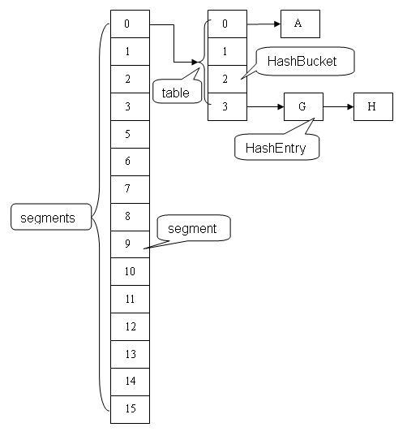

# <center>ConcurrentHashMap (before JDK 1.8)</center>

<br>


<br>


#### 内部数据结构
--------------
&#12288;&#12288;采用分段锁实现并发操作，底层采用数组+链表+红黑树的存储结构。包含两个核心静态内部类Segment和HashEntry:
1. Segment继承ReentrantLock充当锁，每个Segment对象守护每个散列映射表的若干个桶。
2. HashEntry封装映射表的键/值对；

&#12288;&#12288;每个桶是由若干HashEntry链接起来的链表。一个ConcurrentHashMap实例中包含由若干Segment对象组成的数组：

``` java
static final class HashEntry<K,V> {   
       final K key;                       // 声明 key 为 final 型  
       final int hash;                   // 声明 hash 值为 final 型   
       volatile V value;                 // 声明 value 为 volatile 型  
       final HashEntry<K,V> next;      // 声明 next 为 final 型   
  
       HashEntry(K key, int hash, HashEntry<K,V> next, V value) {   
           this.key = key;   
           this.hash = hash;   
           this.next = next;   
           this.value = value;   
       }   
}   

static final class Segment<K,V> extends ReentrantLock implements Serializable {   
  
        transient volatile int count;  // 在本segment范围内，包含的HashEntry元素个数  
                                       //volatile 型   
        transient int modCount;     //table 被更新的次数  
        transient int threshold;    //默认容量  
    	final float loadFactor;    //装载因子  
  
        /**  
         * table 是由 HashEntry 对象组成的数组 
         * 如果散列时发生碰撞，碰撞的 HashEntry 对象就以链表的形式链接成一个链表 
         * table 数组的数组成员代表散列映射表的一个桶         
         */   
        transient volatile HashEntry<K,V>[] table;   
  
        /**  
         * 根据key的hash值，找到table中对应的桶（table数组的某个成员） 
         * 把散列值与table数组长度减1的值相“与”，得到散列值对应的table数组下标 
         * 然后返回table数组中此下标对应的HashEntry元素,即这个段中链表的第一个元素 
         */   
        HashEntry<K,V> getFirst(int hash) {   
            HashEntry<K,V>[] tab = table;               
            return tab[hash & (tab.length - 1)];   
        }   
  
        Segment(int initialCapacity, float lf) {   
            loadFactor = lf;   
            setTable(HashEntry.<K,V>newArray(initialCapacity));   
        }   
  
        /**  
         * 设置 table 引用到这个新生成的 HashEntry 数组 
         * 只能在持有锁或构造函数中调用本方法 
         */   
        void setTable(HashEntry<K,V>[] newTable) {               
            threshold = (int)(newTable.length * loadFactor);   
            table = newTable;   
        }          
}   
```

<br>


#### get方法
--------------
&#12288;&#12288;首先判断当前桶数据个数是否为0。否则，得到头节点后根据hash和key逐个判断是否是指定的值。如果是并且值非空，就说明找到了，直接返回。注意，返回结果时的`return readValueUnderLock(e)`是为了并发考虑的。当`v`为空时，可能是一个线程正在改变节点，而之前的get操作都未进行锁定，所以这里要对`e`重新上锁再读一遍，以保证得到的是正确值。
 
&#12288;&#12288;为什么get需判断`count`不等于_0_？这是用到happens-before原则之volatile变量法则：对volatile写入操作happens-before于每一个后续对同一域的读操作。

&#12288;&#12288;虽然线程N是在未加锁的情况下访问链表。Java内存模型可以保证只要之前对链表做结构性修改操作的写线程M在退出写方法前写volatile变量`count`，读线程N读取`count`后，定能看到修改。这个特性和HashEntry对象的不变性相结合，使读线程在读取散列表时，基本不需要加锁就能成功获得需要的值。这两个特性相配合，不仅减少了请求同一个锁的频率（读操作一般不需要加锁就能够成功获得值），也减少了持有同一个锁的时间（只有`value`为`null`, 读线程才要加锁后重读）。

``` java
V get(Object key, int hash) {  
    if (count != 0) { // read-volatile  
        HashEntry e = getFirst(hash);  
        while (e != null) {  
            if (e.hash == hash && key.equals(e.key)) {  
                V v = e.value;  
                if (v != null)  
                    return v;  
                return readValueUnderLock(e); // recheck  
            }  
            e = e.next;  
        }  
    }  
    return null;  
}  
  
V readValueUnderLock(HashEntry e) {  
    lock();  
    try {  
        return e.value;  
    } finally {  
        unlock();  
    }  
}  
```

<br>


#### put操作
--------------
&#12288;&#12288;先锁定了整个segment，因为修改数据不能并发进行。
 
``` java
V put(K key, int hash, V value, boolean onlyIfAbsent) {  
    lock();  
    try {  
        int c = count;  
        if (c++ > threshold) // ensure capacity  
            rehash();  
        HashEntry[] tab = table;  
        int index = hash & (tab.length - 1);  
        HashEntry first = (HashEntry) tab[index];  
        HashEntry e = first;  
        while (e != null && (e.hash != hash || !key.equals(e.key)))  
            e = e.next;  
  
        V oldValue;  
        if (e != null) {  
            oldValue = e.value;  
            if (!onlyIfAbsent)  
                e.value = value;  
        }  
        else {  
            oldValue = null;  
            ++modCount;  
            tab[index] = new HashEntry(key, hash, first, value);  
            count = c; // write-volatile  
        }  
        return oldValue;  
    } finally {  
        unlock();  
    }  
}  
```

<br>


####  remove操作
----------------------
&#12288;&#12288;类似put，但要注意一点区别，中间for循环是将定位之后的所有entry克隆并拼回前面去。这点是由entry 的不变性决定的。entry中除了value，其他所有属性都是final修饰。意味着在第一次设置了next域后便不能再改变，取而代之的是将它之前的节点全都克隆一次。entry要设置为不变性，因为不变性的访问不需要同步从而节省时间有关。

<p align="center">
  
</p>

<center><i>删除元素之前</i></center>

<br>

<p align="center">
  
</p>

<center><i>删除元素3之后</i></center>
 
``` java
V remove(Object key, int hash, Object value) {  
    lock();  
    try {  
        int c = count - 1;  
        HashEntry[] tab = table;  
        int index = hash & (tab.length - 1);  
        HashEntry first = (HashEntry)tab[index];  
        HashEntry e = first;  
        while (e != null && (e.hash != hash || !key.equals(e.key)))  
            e = e.next;  
  
        V oldValue = null;  
        if (e != null) {  
            V v = e.value;  
            if (value == null || value.equals(v)) {  
                oldValue = v;  
                // All entries following removed node can stay  
                // in list, but all preceding ones need to be  
                // cloned.  
                ++modCount;  
                HashEntry newFirst = e.next;  
                for (HashEntry p = first; p != e; p = p.next)  // 将定位后的所有entry克隆并拼回前面
                    newFirst = new HashEntry(p.key, p.hash,   
                                             newFirst, p.value);  
                tab[index] = newFirst;  
                count = c; // write-volatile  
            }  
        }  
        return oldValue;  
    } finally {  
        unlock();  
    }  
} 
``` 