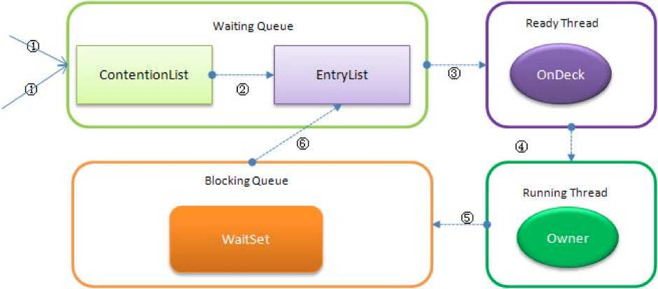

# Synchronized


## 1. 原理
&#12288;&#12288;底层也是基于CAS操作的等待队列，把等待队列分为`ContentionList`和`EntryList`。但由JVM实现，不像ReentrantLock由上层类实现。是非公平悲观锁。


## 2.内部状态和队列

* Contention List：所有请求锁的线程将被首先放置到该竞争队列
* Entry List：Contention List中那些有资格成为候选人的线程被移到Entry List
* Wait Set：那些调用wait方法被阻塞的线程被放置到Wait Set
* OnDeck：任何时刻最多只能有一个线程正在竞争锁，该线程称为OnDeck
* Owner：获得锁的线程称为Owner
* !Owner：释放锁的线程




## 3. 工作流程
* 新请求锁的线程将首先被加入到ContentionList中

1. `ContentionList`只是一个虚拟队列，原因在于`ContentionList`是由`Node`及其`next`指针逻辑构成，并不存在一个Queue的数据结构。
2. `ContentionList`是一个后进先出（LIFO）的队列，每次新加入Node时都会在队头进行，通过CAS改变第一个节点的的指针为新增节点，同时设置新增节点的next指向后续节点，而取得操作则发生在队尾。显然，该结构其实是个Lock-Free的队列。
3. 因为只有Owner线程才能从队尾取元素，也即线程出列操作无争用，当然也就避免了CAS的ABA问题。

* 当某个拥有锁的线程（Owner状态）调用unlock之后，如果发现EntryList为空则从ContentionList中移动线程到EntryList

1. `EntryList`与`ContentionList`逻辑上同属等待队列，`ContentionList`会被线程并发访问，为了降低对`ContentionList`队尾的争用，而建立`EntryList`。
2. Owner线程在unlock时会从`ContentionList`中迁移线程到`EntryList`，并会指定`EntryList`中的某个线程（一般为Head）为Ready（OnDeck）线程。
3. Owner线程并不是把锁传递给OnDeck线程，只是把竞争锁的权利交给OnDeck，OnDeck线程需要重新竞争锁。
4. OnDeck线程获得锁后即变为owner线程，无法获得锁则会依然留在`EntryList`中，考虑到公平性，在`EntryList`中的位置不发生变化（依然在队头）。如果Owner线程被wait方法阻塞，则转移到WaitSet队列；如果在某个时刻被notify/notifyAll唤醒，则再次转移到`EntryList`。

* 处于ContetionList、EntryList、WaitSet中的线程均处于阻塞状态，阻塞操作由操作系统完成。线程被阻塞后便进入内核（Linux）调度状态
        
&#12288;&#12288;缓解上述问题的办法便是自旋，其原理是：当发生争用时，若Owner线程能在很短的时间内释放锁，则那些正在争用线程可以稍微等一等（自旋），在Owner线程释放锁后，争用线程可能会立即得到锁，从而避免了系统阻塞 。

&#12288;&#12288;那`synchronized`实现何时使用了自旋锁？答案是在线程进入`ContentionList`时，也即第一步操作前。
 


## 4. 偏向锁
&#12288;&#12288;在JVM1.6中引入了偏向锁，偏向锁主要解决无竞争下的锁性能问题，首先看下无竞争下锁存在什么问题.

&#12288;&#12288;现在几乎所有的锁都是可重入的，也即已经获得锁的线程可以多次锁住/解锁监视对象。每次加锁/解锁都会涉及到一些CAS操作（比如对等待队列的CAS操作），CAS操作会延迟本地调用，因此偏向锁的想法是一旦线程第一次获得了监视对象，之后让监视对象“偏向”这个线程，之后的多次调用则可以避免CAS操作，说白了就是置个变量，如果发现为true则无需再走各种加锁/解锁流程


## 5. 当一个线程进入某个对象的一个synchronized的实例方法后，其它线程是否可进入此对象的其它方法？
* 如果另一个方法不是`synchronized`则可以进入。
* 如果另一个方法是`static`方法，则可以进入，因为对于`static`方法，获取的是类的`class`对象（字节码文件）的锁而非同一个实例对象的锁。
* 如果正在进入的对象可以通过`wait()`释放锁，那么该线程还可以进入这个对象的其他`synchronized`方法。
* 如果另一个方法也是`synchronized`的，并且已经进入的方法中不能`wait()`释放锁，那么就不能进入那个方法。


## 6. synchronized vs ReentrantLock
* synchronized keyword cannot be used for constructors and variables. 
* We should not use any object that is maintained in a constant pool, for example String should not be used for synchronization because if any other code is also locking on same String, it will try to acquire lock on the same reference object from String pool and even though both the codes are unrelated, they will lock each other.
* `synchronized`是Java语言特性，得到虚拟机直接支持，`Lock`是`concurrent`包下的类
* synchronized在进入退出同步方法代码块时会自动获取释放锁，`ReentrantLock`须显式获取锁，且要在`finally`中显式释放锁 。Synchronization code is much cleaner and easy to maintain.
* 在资源竞争不是很激烈的情况下，`Synchronized`性能优于`ReetrantLock`，但在资源竞争激烈情况下，`Synchronized`性能会下降几十倍，但是`ReetrantLock`的性能能维持常态。
* ReentrantLock提供了更大的灵活性
    * 可以通过`tryLock`实现轮询或定时获取锁，可用于避免死锁的发生
    * `lockInterruptibly`方法能在获取锁的过程中保持对中断的响应
    * `synchronized`方法和`synchronized`块都是基于块结构的加锁，`ReentrantLock`可用于非块结构加锁（例如ConcurrentHashMap中的分段锁）
    * `synchronized`使用的内置锁和`ReentrantLock`默认都是非公平的，`ReentrantLock`在构造时可选择公平锁。


## 7. Condition VS wait/notify
&#12288;&#12288;Lock对应synchronized，使用之前都要先获取锁 ：

|            |    Object  | Condition  |
| ---------- | :--------: | :--------: |
| 休眠        |   wait     |  await     |
| 唤醒单个线程 |   notify   |  signal    |
| 唤醒所有线程 |  notifyAll | signalAll  |
                                     
&#12288;&#12288;Condition更强大的地方在于能够更加精细的控制多线程的休眠与唤醒。 

&#12288;&#12288;例如，多线程读/写缓冲区：当向缓冲区中写入数据之后，唤醒读线程；当从缓冲区读出数据之后，唤醒写线程。 如果采用`Object`类中的`wait()`, `notify()`, `notifyAll()`实现该缓冲区，当向缓冲区写入数据之后需要唤醒读线程时，不可能通过`notify()`或`notifyAll()`明确的指定唤醒读线程，而只能通过`notifyAll`唤醒所有线程(但是`notifyAll()`无法区分唤醒的线程是读线程，还是写线程)。 通过Condition，就能明确的指定唤醒读线程。

```java
private volatile boolean usedData = true;//mutex for data
private final Lock lock = new ReentrantLock();
private final Condition isEmpty = lock.newCondition();
private final Condition isFull = lock.newCondition();

public void setData(int data) throws InterruptedException {
    lock.lock();
    try {
        while(!usedData) {//wait for data to be used
            isEmpty.await();
        }
        this.data = data;
        isFull.signal();//broadcast that the data is now full.
        usedData = false;//tell others I created new data.          
    }finally {
        lock.unlock();//interrupt or not, release lock
    }       
}

public void getData() throws InterruptedException{
    lock.lock();
    try {
        while(usedData) {//usedData is lingo for empty
            isFull.await();
        }
        isEmpty.signal();//tell the producers to produce some more.
        usedData = true;//tell others I have used the data.
    }finally {//interrupted or not, always release lock
        lock.unlock();
    }       
}
```

Condition interface comes with Two extra methods that are:
1. `boolean awaitUntil(Date deadline)throws InterruptedException`: causes the current thread to wait until it is signaled or interrupted, or the specified deadline elapses.
2. `awaitUninterruptibly()`: causes the current thread to wait until it is signaled.


## 8. synchronized与static synchronized区别
&#12288;&#12288;synchronized是对类当前实例加锁，防止其他线程同时访问该类的该实例的synchronized块，注意是“类当前实例”， 类的两个不同实例没有这种约束。
        
&#12288;&#12288;static synchronized是控制类所有实例的访问，static synchronized是限制线程同时访问jvm中该类的所有实例同时访问对应的代码快。