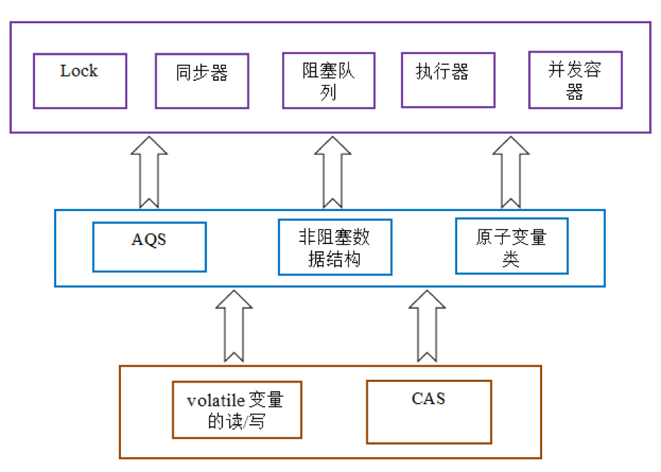

# <center>Concurrent Conclusion</center>

<br></br>




<br></br>


## 线程状态
----


1. 新建(new)：新创建了一个线程对象。
2. 可运行(runnable)：线程创建后，其他线程调用了该对象的`start()`，该状态的线程位于可运行线程池中，等待被线程调度选中，获取cpu使用权 。
3. 运行(running)：可运行状态(runnable)的线程获得了cpu时间片（timeslice），执行程序。
4. 阻塞(block)：线程因为某种原因放弃了cpu使用权，暂时停止运行，阻塞的情况分三种： 
    1. 等待阻塞：运行的线程执行`wait()`，JVM把该线程放入等待队列(waitting queue)中。
    2. 同步阻塞：运行的线程在获取对象同步锁时，若该同步锁被别的线程占用，则JVM会把该线程放入锁池(lock pool)中。
    3. 其他阻塞：运行的线程执行`Thread.sleep(long ms)`或`t.join()`，或者发出I/O请求时，JVM会把该线程置为阻塞状态。当`sleep()`状态超时、`join()`等待线程终止或者超时、或者I/O处理完毕时，线程重新转入可运行(runnable)状态。
5. 死亡(dead)：线程`run()`、`main() `方法执行结束，或者因异常退出了`run()`，则该线程结束生命周期。

`wait()`与`sleep()`区别：
* `wait()`是Object方法，而`sleep()`是Thread类的静态方法
*  `sleep()`使线程阻塞指定时间，这段时间当前线程让出CPU时间，时间结束后继续执行，该过程不释放线程持有的对象锁
* `wait()`释放锁并进入该锁等待队列，当收到持有锁的其它线程`notify()`或`notifyAll()`信号后，`wait()`方法返回。

`run()`与`start()`区别：
* 通过调用`Thread`类的`start()`启动线程，这时此线程处于就绪状态，并没有运行，一旦得到时间片就开始执行`run()`。
* `run()`只是类的一个普通方法，如果直接调用`run()`，程序中依然只有主线程这一个线程，没有达到写线程的目的。

<br></br>


## 常用数据结构原理
----
### AtomicInteger, AtomicBoolean & AtomicLong
基于**CAS**，是**乐观锁**。

<br>


### ConcurrentHashMap
JDK 1.8前基于**segment的lock**，JDK1.8是对node使用了`volatile`保证读的**happens-before**。在写数据时，如果是新的结点，使用**CAS**，其它则用**synchronized**。

<br>


### BlockingQuque
原理：
* ArrayBlockingQueue是一个由数组支持的有界阻塞队列。 创建时默认非公平锁，不过可在它的构造函数里指定,因为调用ReentrantLock的构造函数创建锁。
* SynchronousQueue同步队列没有任何内部容量。不能在同步队列上进行`peek()`，因为仅在试图要取得元素时，该元素才存在；除非另一个线程试图移除某个元素，否则也不能使用任何方法添加元素；也不能迭代队列，因为其中没有元素可用于迭代。
* LinkedBlockingQueue是一个基于已链接节点的、范围任意的blocking queue。队列的头部是在队列中时间最长的元素。队列的尾部是在队列中时间最短的元素。新元素插入到队列的尾部，队列检索操作会获得位于队列头部的元素。链接队列的吞吐量通常要高于基于数组的队列，但是在大多数并发应用程序中，其可预知的性能要低。

> LinkedBlcokingQueue和ArrayBlockingQueue用ReentrantLock，默认非公平锁，即阻塞式队列。其中LinkedBlockingQueue使用了2个lock，takelock和putlock，读和写用不同的lock来控制，这样并发效率更高。

<br>


### ConcurrentLinkedQueue
使用**CAS**，即”lock-free”的非阻塞式算法。

<br>


### CopyOnWriteArrayList & CopyOnWriteArraySet
复制时候用lock。

```java
public boolean add(T e) {
    final ReentrantLock lock = this.lock;
    lock.lock();
    try {
        Object[] elements = getArray();
        int len = elements.length;
        // copy data to new array
        Object[] newElements = Arrays.copyOf(elements, len + 1);
        // add new data into new array
        newElements[len] = e;
        // change old array reference
        setArray(newElements);

        return true;
    } finally {
        lock.unlock();
    }
}
```

<br>


### AQS
AQS(AbstractQueuedSynchronizer)为实现依赖于先进先出 (FIFO) 等待队列的阻塞锁和相关同步器（信号量、事件，等等）提供一个框架。

队列节点为：
```java
static final class Node {
	static final int CANCELLED = 1;
	static final int SIGNAL = -1;
	static final int CONDITION = -2;
	static final int PROPAGATE = -3;

	volatile int waitStatus;
	volatile Node prev;
	volatile Node next;
	volatile Thread thread;

	Node nextWaiter;
	Node(Thread thread, Node mode) { // Used by addWaiter
		this.nextWaiter = mode;
		this.thread = thread;
	}
	Node(Thread thread, int waitStatus) { // Used by Condition
		this.waitStatus = waitStatus;
		this.thread = thread;
	}
}
```

对于首尾结点（即获取释放锁和阻赛线程）和结点status设置都是类似CAS语义。


<br>


### HashTable
**sychronized**

<br>


### ReentrantLock
ReentrantLock由最近成功获取锁，还没有释放的线程所拥有，当锁被另一个线程拥有时，调用`lock()`方法的线程可以成功获取锁。如果锁已经被当前线程拥有，当前线程会立即返回。
        
在AQS里面有一个`state`字段，在ReentrantLock中表示锁被持有的次数，它是一个`volatile`类型的整型值。一个线程持有锁，`state = 1`,如果它再次调用`lock()`，那么`state = 2`.当前可重入锁要完全释放，调用了多少次`lock()`，还得调用等量的`unlock()`来释放锁。

ReentrantLock**默认是nonfair**，当中的`lock()`是通过`static`内部类`sync`来进行锁操作：

``` java
public void lock() {
     sync.lock();
}
//定义成final型的成员变量，在构造方法中进行初始化 
private final Sync sync;
//无参数默认非公平锁
public ReentrantLock() {
    sync = new NonfairSync();
}
//根据参数初始化为公平锁或者非公平锁 
public ReentrantLock(boolean fair) {
    sync = fair ? new FairSync() : new NonfairSync();
}
```

<br>


### Synchronized
**是fair**。

<br></br>


