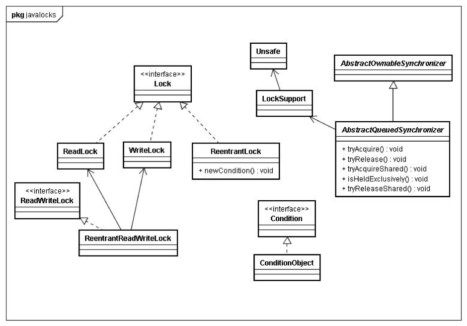

# <center>ReentrantLock</center>


<br></br>

* 悲观锁。
* synchronized可重入，ReentrantLock不是。
* synchronized是Java语言特性，得到虚拟机直接支持。ReentrantLock是concurrent包下的类。
* ReentrantLock实例化内部类Sync（fair或nofair），Sync类基于AQS。
* 公平锁和非公平锁释放时，最后都要写一个volatile变量`state`。
* 公平锁获取时，首先读这个volatile变量。
* 非公平锁获取时，首先用CAS更新这个volatile变量（`compareAndSetState(int expect, int update)`），CAS操作同时有volatile读和volatile写内存语义。



<br></br>


## synchronized vs ReentrantLock
----
* synchronized是Java语言特性，得到虚拟机直接支持。ReentrantLock是concurrent包下的类。
* synchronized进入退出同步方法代码块时会自动获取释放锁。ReentrantLock须显式获取锁，且要在finally中显式释放锁。
* 在资源竞争不是很激烈的情况下，synchronized性能优于ReetrantLock。但在资源竞争激烈情况下，synchronized性能会下降几十倍，但是ReetrantLock性能维持常态。
* ReentrantLock提供更大灵活性：
    * 可通过`tryLock()`实现轮询或定时获取锁，避免死锁发生；
    * `lockInterruptibly()`能在获取锁过程中保持对中断响应；
    * synchronized方法和synchronized块都基于块结构加锁，ReentrantLock可用于非块结构加锁（例如ConcurrentHashMap中分段锁）；
    * synchronized使用内置锁和ReentrantLock默认都是非公平，ReentrantLock可选择公平锁。
* Lock对应synchronized，使用之前都要先获取锁：

|            |    Object  | Condition  |
| ---------- | :--------: | :--------: |
| 休眠        |   wait     |  await     |
| 唤醒单个线程 |   notify   |  signal    |
| 唤醒所有线程 |  notifyAll | signalAll  |

<br></br>


## 可重入锁
----

```java
public class Child extends Father implements Runnable {
	final static Child child = new Child(); // 保证锁唯一

	public static void main(String[] args) {
		for (int i = 0; i < 50; i++)
			new Thread(child).start();
	}

	public synchronized void doSomething() {
		System.out.println("1child.doSomething()");
		doAnotherThing(); // 调用自己类中其他synchronized方法
	}

	private synchronized void doAnotherThing() {
		super.doSomething(); // 调用父类synchronized方法
		System.out.println("3child.doAnotherThing()");
	}

	@Override
	public void run() {
		child.doSomething();
	}
}

class Father {
	public synchronized void doSomething() {
		System.out.println("2father.doSomething()");
	}
}
```

锁都是`child`对象。当执行`child.doSomething()`时，该线程获得`child`对象锁。在`doSomething()`方法内执行`doAnotherThing()`时再请求`child`对象锁。因为synchronized是重入锁，所以可得该锁。继续在`doAnotherThing()`执行父类`doSomething()`方法时第三次请求`child`对象锁，同理可得。如果不是重入锁，后面两次请求锁会被阻塞，导致死锁。 

<br></br>


## 锁可重入性
----
synchronized同步块是可重入的，意味着如果一个线程进入synchronized同步块，并因此获得该同步块使用同步对象对应的管程上的锁，那么这个线程可进入由同一个管程对象所同步的另一个代码块：

``` java
public class Reentrant{
    public synchronized outer() {
        inner();
    }

    public synchronized inner() {
        //do something
    }
}
```

`outer()`和`inner()`都被声明为synchronized，和`synchronized(this)`块等效。如果一个线程调用`outer()`，在`outer()`里调用`inner()`就没有问题，因为这两个方法（代码块）都由同一个管程对象（`this`)同步。如果一个线程已拥有一个管程对象上锁，那么它就有权访问被这个管程对象同步的所有代码块。这就是可重入。

下面锁实现不是可重入的。当线程调用`outer()`时，会在`inner()`方法`lock.lock()`处阻塞住。

``` java
public class Reentrant2{
    Lock lock = new Lock();

    public outer(){
        lock.lock();
        inner();
        lock.unlock();
    }

    public synchronized inner(){
        lock.lock();
        //do something
        lock.unlock();
    }
}
```

调用`outer()`的线程首先锁住Lock实例，然后继续调用`inner()`。`inner()`方法中该线程将再一次尝试锁住Lock实例，结果该动作会失败，因为这个Lock实例已在`outer()`方法中被锁住了。

两次`lock()`间没有调用`unlock()`，第二次调用lock就会阻塞。看过`lock()`实现后，会发现原因：

``` java
public class Lock {
    boolean isLocked = false;

    public synchronized void lock() throws InterruptedException{
        while(isLocked)
            wait();
        isLocked = true;
    }
}
```

一个线程是否被允许退出`lock()`方法是由while循环（自旋锁）中条件决定。判断条件是只有当`isLocked`为`false`时，lock操作才被允许，而没有考虑是哪个线程锁住它。

为让Lock类有可重入性，做一点改动：

``` java
public class Lock {
    boolean isLocked = false;
    Thread  lockedBy = null;
    int lockedCount = 0;

    public synchronized void lock() throws InterruptedException {
        Thread callingThread = Thread.currentThread();
        while(isLocked && lockedBy != callingThread)
            wait();
        isLocked = true;
        lockedCount++;
        lockedBy = callingThread;
    }

    public synchronized void unlock() {
        if(Thread.curentThread() == this.lockedBy) {
            lockedCount--;
            if(lockedCount == 0) {
                isLocked = false;
                notify();
            }
        }
    }
}
```

现在while循环考虑到了已锁住该Lock实例的线程。如果当前锁对象没被加锁(`isLocked = false`)，或当前调用线程已对该Lock实例加锁，那么while循环不会被执行，调用`lock()`线程就可退出该方法。

此外，需记录同一个线程重复对一个锁对象加锁次数。否则，一次`unblock()`调用会解除整个锁，即使当前锁已被加锁过多次。

现在这个Lock类是可重入的了。

<br></br>


## 抽象类Sync
----
ReentrantLock中有一个抽象类Sync：

``` java
private final Sync sync;

abstract static class Sync extends AbstractQueuedSynchronizer {
    ...
    }
```

ReentrantLock根据传入构造方法的布尔型参数实例化Sync实现类`FairSync`和`NonfairSync`，默认Nonfair。

<br></br>


## Nonfair获取锁
-----

```java
        final boolean nonfairTryAcquire(int acquires) {
            final Thread current = Thread.currentThread();
            int c = getState();

            if (c == 0) {
                if (compareAndSetState(0, acquires)) {
                    setExclusiveOwnerThread(current);
                    return true;
                }
            } else if (current == getExclusiveOwnerThread()) {
                int nextc = c + acquires;
                if (nextc < 0) // overflow
                    throw new Error("Maximum lock count exceeded");
                setState(nextc);
                return true;
            }
            return false;
        }
```

1. 首先判断当前状态。如果`c == 0`说明没有线程竞争该锁，如果`c != 0`说明有线程拥有锁。
2. 如果`c == 0`，通过CAS设置状态值为`acquires`。`acquires`初始调用值为1，每次线程重入该锁会+1，每次unlock会-1，为0时释放锁。如果CAS设置成功，则其他线程调用CAS都不会成功，也就认为当前线程得到该锁 。
3. 如果`c != 0`但已拥有锁，只是简单地`++acquires`，并修改status值。但因为没有竞争，所以通过`setState()`修改，而非CAS，也就是说实现了偏向锁。

<br></br>


## 用ReentrantLock解决死锁
----
synchronized产生死锁：
```java
public class Uninterruptible {
    public static void main(String[] args) throws InterruptedException {
        final Object o1 = new Object(), o2 = new Object();

        Thread t1 = new Thread() {
            public void run() {
                try {
                    synchronized(o1) {
                        Thread.sleep(1000);
                        synchronized(o2) {}
                    }
                } catch (InterruptedException e) {
                    System.out.println("t1 interrupted.");
                }
            }
        };

        Thread t2 = new Thread() {
            public void run() {
                try {
                    synchronized(o2) {
                        Thread.sleep(1000);
                        synchronized(o1) {}
                    } catch (InterruptedException e) {
                        System.out.println("t2 interrupted.");
                    }
                }
            }
        };

        t1.start();
        t2.start();
        Thread.sleep(2000);
        t1.interrupt(); t2.interrupt();  // 无法中断死锁线程
    }
}
```

使用ReentrantLock的`lockInterruptibly()`终止死锁线程：

```java
public class Interruptible {
    public static void main(String[] args) throws InterruptedException {
        final ReentrantLock l1 = new ReentrantLock();
        final ReentrantLock l2 = new ReentrantLock();

        Thread t1 = new Thread() {
            public void run() {
                try {
                    l1.lockInterruptibly(); // 获取可中断的锁l1且为t1互斥访问加锁
                    // 访问t1互斥资源
                    Thread.sleep(1000);
                    l2.lockInterruptibly(); // 获取可中断的锁l2
                    // 访问t2互斥资源
                } catch (InterruptedException e) {
                    System.out.println("t1 interrupted.");
                }
            }
        };

        Thread t2 = new Thread() {
            public void run() {
                try {
                    synchronized(o2) {
                        l2.lockInterruptibly();
                        Thread.sleep(1000);
                        l1.lockInterruptibly();
                    } catch (InterruptedException e) {
                        System.out.println("t2 interrupted.");
                    }
                }
            }
        };

        t1.start(); t2.start();
        Thread.sleep(2000);
        t1.interrupt(); t2.interrupt();  // 可以中断线程
    }
}
```

<br></br>


## 交替锁
----
链表需插入一个节点，一种做法是锁整个链表，效率低。交替锁只锁住链表一部分。在链表中交替加锁过程为不断的加锁和解锁，直到找到要插入的位置对两边的节点加锁。

<p align="center">
  
</p>

内置锁无法完成这种效果，可用ReentrantLock在需要地方使用`lock()`和`unlock()`。

```java
class ConcurrentSortedList {
    private class Node {
        int value;
        Node prev, next;
        ReentrantLock lock = new ReentrantLock();

        Node(int value, Node prev, Node next) {
            this.value =value; this.prev = prev; this.next = next;
        }
    }

    private final Node head;
    private final Node tail;

    public ConcurrentSortedList() {
        head = new Node(); tail = new Node();
        head.next = tail; tail.prev = head;
    }

    public void insert(int value) {
        Node current = head;
        current.lock.lock();
        Node next = current.next;
        try {
            while (true) {
                next.lock.lock();
                try {
                    // 找到插入位置则插入且跳出while
                    // 否则获取锁判断，再在finally中释放锁
                    if (next == tail || next.value < value) {
                        Node node = new Node(value, current, next);
                        next.prev = node;
                        current.next = node;

                        return;
                    }
                } finally {
                    current.lock.lock();
                }
                current = next;
                next = current.next;
            }
            finally {
                next.lock.unlock();  // 未找到插入位置，则释放锁
            }
        }
    }
}
```

<br></br>


## 公平锁分析（`tryAcquire()` & `tryRelease()`）
----
使用公平锁时，加锁方法`lock()`调用轨迹如下：
1. ReentrantLock: `lock()`
2. FairSync: `lock()`
3. AbstractQueuedSynchronizer: `acquire(int arg)`
4. ReentrantLock: `tryAcquire(int acquires)`

在第4步开始加锁：
``` java
protected final boolean tryAcquire(int acquires) {
    final Thread current = Thread.currentThread();
    int c = getState();   // 获取锁的开始，首先读volatile变量state

    if (c == 0) {
        if (isFirst(current) && compareAndSetState(0, acquires)) {
            setExclusiveOwnerThread(current);
            return true;
        }
    } else if (current == getExclusiveOwnerThread()) {
        int nextc = c + acquires;
        if (nextc < 0)  
            throw new Error("Maximum lock count exceeded");
        setState(nextc);
        return true;
    }

    return false;
}
```

加锁方法先读volatile变量`state`。

解锁方法`unlock()`调用轨迹如下：
1. ReentrantLock: `unlock()`
2. AbstractQueuedSynchronizer: `release(int arg)`
3. Sync: `tryRelease(int releases)`

在第3步开始释放锁：
``` java
        protected final boolean tryRelease(int releases) {
            int c = getState() - releases;
            if (Thread.currentThread() != getExclusiveOwnerThread())
                throw new IllegalMonitorStateException();
            boolean free = false;
            if (c == 0) {
                free = true;
                setExclusiveOwnerThread(null);
            }
            setState(c);

            return free;
        }
```

`tryRelease()`与`tryAcquire()`语义相同，把释放逻辑延迟到子类。`tryRelease()`语义很明确，如果线程多次锁定，则多次释放，直至`status == 0`真正释放锁。所谓释放锁即设置`status`为0，因为无竞争所以没有使用CAS。

<br></br>
