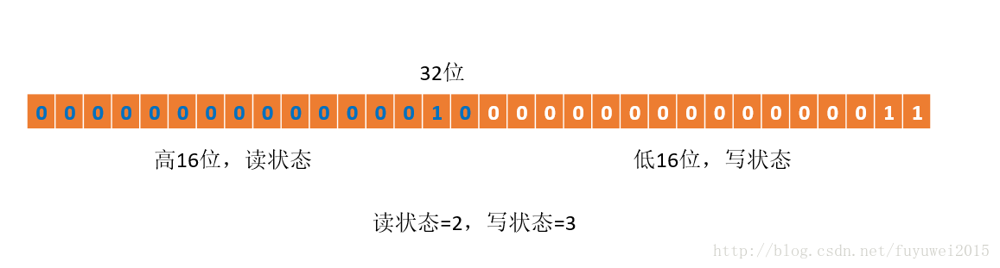

# <center>ReentrantReadWriteLock</center>


<br></br>

* 读锁重入允许多个申请读操作线程，而写锁同时只允许单个线程占有，该线程写操作可重入。
* 如果一个线程占有写锁，在不释放写锁情况下，还能占有读锁，即写锁降为读锁。
* 对同时占有读写锁线程，如果释放写锁，转换成读锁，以后写操作无法重入。写锁未完全释放时写操作可重入。
* 公平模式下读写锁申请按照AQS锁等待队列FIFO。非公平模式读操作插队条件是锁等待队列head下一个节点是SHARED型节点。写锁无条件插队。

<br></br>


## What
----
`ReentrantReadWriteLock`没有继承`ReentrantLock`，也没有实现`Lock`接口，而是实现`ReadWriteLock`接口。该接口提供`readLock()`方法获取读锁，`writeLock()`获取写锁。

```java
public class ReentrantReadWriteLock
        implements ReadWriteLock, java.io.Serializable {
    private final ReentrantReadWriteLock.ReadLock readerLock;
    private final ReentrantReadWriteLock.WriteLock writerLock;

    public ReentrantReadWriteLock.WriteLock writeLock() { return writerLock; }
    public ReentrantReadWriteLock.ReadLock  readLock()  { return readerLock; }
}

public interface ReadWriteLock {
    Lock readLock();
    Lock writeLock();
}
```

默认构造方法非公平，可指定`fair`为`true`设为公平。

```java
    public ReentrantReadWriteLock() {
        this(false);
    }

    public ReentrantReadWriteLock(boolean fair) {
        sync = fair ? new FairSync() : new NonfairSync();
        readerLock = new ReadLock(this);
        writerLock = new WriteLock(this);
    }

    public static class ReadLock implements Lock, java.io.Serializable {}
    public static class WriteLock implements Lock, java.io.Serializable {}
```

公平和非公平模式由内部类`FairSync`和`NonfairSync`实现，这两个类继承内部类`Sync`。`Sync`继承`AbstractQueuedSynchronizer`。基本同`ReentrantLock`内部一致。

```java
abstract static class Sync extends AbstractQueuedSynchronizer {}

static final class FairSync extends Sync {}

static final class NonfairSync extends Sync {}
```

`ReentrantLock`独占性和重入性通过CAS维护AQS的`state`变量实现。`ReentrantReadWriteLock`将int型`state`变量分为高16位和低16位，高16位表示读锁占有量，低16位表示写锁占有量：

```java
abstract static class Sync extends AbstractQueuedSynchronizer {
        static final int SHARED_SHIFT   = 16;
        static final int SHARED_UNIT    = (1 << SHARED_SHIFT);
        static final int MAX_COUNT      = (1 << SHARED_SHIFT) - 1;
        static final int EXCLUSIVE_MASK = (1 << SHARED_SHIFT) - 1;

        /** Returns the number of shared holds represented in count  */
        static int sharedCount(int c)    { return c >>> SHARED_SHIFT; }
        /** Returns the number of exclusive holds represented in count  */
        static int exclusiveCount(int c) { return c & EXCLUSIVE_MASK; }
}
```

<p align="center">
  
</p>

当前同步状态表示一个线程已获取写锁且重入2次，同时也获取2次读锁。

> 读写锁通过位运算确定读写各自状态。假设当前同步状态值为S，写状态等于S&0x0000FFFF（将高16位全部抹去），读状态等于S>>>16（无符号补0右移16位）。当写状态增加1时，等于S+1，当读状态增加1时，等于S+(1<<16)，也就是S+0x00010000。根据状态的划分能得出一个推论：S不等于0时，当写状态（S&0x0000FFFF）等于0时，则读状态（S>>>16）大于0，即读锁已被获取。

<br></br>


## 读锁分析
----
读锁锁定的是AQS的`state`变量高16位。当`state`高16位等于0，表示读锁未被占有；高16位大于0，表示读锁被一个或多个线程占有。

<br>


### 读锁竞争
<p align="center">
  
</p>

<center><i>读锁竞争过程</i></center>

<br>

读锁获取条件要满足:
1. 当前写锁未被占有（AQS的`state`变量低16位为0）或当前线程是写锁占有的线程。这使读锁与写锁互斥，除非当前申请读操作的线程是占有写锁的线程，即实现写锁降为读锁。
2. `readerShouldBlock()`方法返回false。
3. 当前读锁占有量小于最大值$$2^{16}-1$$。保证读锁的占有数不超过最大上限.
4. 成功通过CAS将读锁占有量+1（AQS的`state`高16位同步加1）。保证多线程竞争读锁时的安全性。

条件2在非公平下执行的是`NonfairSync`类的`readerShouldBlock()`方法：
```java
    final boolean readerShouldBlock() {
        return apparentlyFirstQueuedIsExclusive();
    }

    final boolean apparentlyFirstQueuedIsExclusive() {
        Node h, s;
        return (h = head) != null &&
            (s = h.next)  != null &&
            !s.isShared()         &&
            s.thread != null;
    }
```

如果AQS锁等待队列head节点后的节点非共享节点（等待读锁的节点），将返回true。

条件2在公平模式下执行的是`FairSync`类的`readerShouldBlock()`方法：
```java
    final boolean readerShouldBlock() {
        return hasQueuedPredecessors();
    }

    public final boolean hasQueuedPredecessors() {
        Node t = tail; // Read fields in reverse initialization order
        Node h = head;
        Node s;
        return h != t &&
            ((s = h.next) == null || s.thread != Thread.currentThread());
    }
```

只要AQS锁等待队列头尾不为空，且存在head后节点且节点线程非当前线程，返回true。

不满足条件申请读锁的线程会被封装为SHARED类型线程节点插入AQS锁等待队列末尾。插入队尾后有一次机会尝试获取读锁。如果失败，判断如果队列前一节点是SIGNAL状态就将线程挂起。当线程唤醒后再尝试获取读锁，不满足条件再次挂起，以此循环。

如果在线程挂起前获取读锁，将当前节点设为head节点，并将head后SHARED类型节点唤醒，然后进入读锁同步区域。被唤醒线程尝试获取读锁，成功后继续上述步骤，保证队列中连续等待读锁的线程依次唤醒进入读锁同步区。

<br>


### 读锁释放
释放过程即AQS的`state`高16位同步递减为0过程。当`state`高16位为0，表示读锁释放完毕。如果此时写锁状态为0（即该读锁不是写锁降级来的），唤醒head节点后下一个SIGNAL状态节点线程，一般为等待写锁的节点。如果读锁占有数不为0，表示读锁未完全释放。或写锁占有数不为0，表示释放的读锁是写锁降级来的。

<p align="center">
  
</p>

<center><i>读锁的释放</i></center>

<br>


### Source Code
没有其他写线程访问（或写状态为0）时，读锁总被成功获取，所做的只是线程安全增加读状态。如果当前线程已获取读锁，则增加读状态。如果当前线程获取读锁时，写锁已被其他线程获取，则进入等待状态。读状态是所有线程获取读锁次数的总和，而每个线程各自获取读锁次数只能选择保存在ThreadLocal中，由线程自身维护。

```java
protected final int tryAcquireShared(int unused) {
    /*
    * 1. If write lock held by another thread, fail.
    *
    * 2. Otherwise, this thread is eligible for
    *    lock wrt state, so ask if it should block
    *    because of queue policy. If not, try
    *    to grant by CASing state and updating count.
    *    Note that step does not check for reentrant
    *    acquires, which is postponed to full version
    *    to avoid having to check hold count in
    *    the more typical non-reentrant case.
    *
    * 3. If step 2 fails either because thread
    *    apparently not eligible or CAS fails or count
    *    saturated, chain to version with full retry loop.
    */
    Thread current = Thread.currentThread();
    int c = getState();
    if (exclusiveCount(c) != 0 && getExclusiveOwnerThread() != current)
        return -1;

    int r = sharedCount(c);
    if (!readerShouldBlock() &&
        r < MAX_COUNT &&
        compareAndSetState(c, c + SHARED_UNIT)) {
        if (r == 0) {
            firstReader = current;
            firstReaderHoldCount = 1;
        } else if (firstReader == current) {
            firstReaderHoldCount++;
        } else {
            HoldCounter rh = cachedHoldCounter;
            if (rh == null || rh.tid != current.getId())
                cachedHoldCounter = rh = readHolds.get();
            else if (rh.count == 0)
                readHolds.set(rh);
            rh.count++;
        }
        
        return 1;
    }
    
    return fullTryAcquireShared(current);
}

在`tryAcquireShared(int unused)`方法中，如果其他线程已获取写锁，则当前线程获取读锁失败，进入等待状态。如果当前线程获取写锁或写锁未被获取，则当前线程（线程安全，依靠CAS）增加读状态，成功获取读锁。读锁每次释放（线程安全，可能多个读线程同时释放读锁）均减少读状态，减少值是`1<<16`。
```

<br></br>


## 写锁分析
----
写锁状态为AQS的`state`低16位。为0表示写锁没被占有，反之表示写锁被某个写线程占有（`state = 1`）或重入（`state > 1`）。

<br>


### 写锁竞争
<p align="center">
  
</p>

<center><i>写锁竞争过程</i></center>

<br>

写锁获取要满足：
1. 读锁未被占用（`state`高16位为0)，写锁未被占用（`state`低16位为0）或占用写锁的线程是当前线程。使写锁与读锁互斥，ReentrantReadWriteLock没有读锁升级功能。
2. `writerShouldBlock()`方法返回false，不阻塞写线程。
3. 当前写锁占有量小于最大值$$2^{16}-1$$，否则抛出_Maximum lock count exceeded_。保证写锁占有线程重入次数不溢出上限。
4. 通过CAS将写锁状态+1，即将`state`低16位同步+1。保证多个写操作线程竞争写锁的安全性。

条件2`writerShouldBlock()`方法在非公平下为：
```java
        final boolean writerShouldBlock() {
            return false; // writers can always barge
        }
```
即非公平模式下允许满足条件的写操作直接插队。

在公平模式下为：
```java
        final boolean writerShouldBlock() {
            return hasQueuedPredecessors();
        }
```

公平模式下同读锁一样，如果AQS锁等待队列不空，写操作无法插队。

不满足获取写锁条件的线程封装为EXECLUSIVE型节点插入AQS锁等待队尾，通过`acquireQueued()`方法进入循环。循环内再次尝试获取写锁（因为经过上述操作，另一个锁占有线程可能释放锁），否则通过`shouldParkAfterFailedAcquire()`方法将前一节点设为SIGNAL状态后将自身线程挂起。线程唤醒后再次尝试获取写锁，失败继续挂起，以此循环。或成功占有写锁将当前节点设为head节点，返回中断标记并进入同步代码区。

**与读操作不同的是写操作间互斥，获取写锁后不会将下一个申请写操作节点唤醒。**

<br>


### Source Code
如果当前线程已获取写锁，则增加写状态。如果当前线程获取写锁时，读锁已被获取（读状态不为0）或该线程不是已获取写锁的线程，则进入等待状态。

```java
protected final boolean tryAcquire(int acquires) {
    /*
    * 1. If read count nonzero or write count nonzero
    *    and owner is a different thread, fail.
    *
    * 2. If count would saturate, fail. (This can only
    *    happen if count is already nonzero.)
    *
    * 3. Otherwise, this thread is eligible for lock if
    *    it is either a reentrant acquire or queue policy
    * allows it. If so, update state and set owner.
    */
    Thread current = Thread.currentThread();
    int c, w = getState(), exclusiveCount(c);
    if (c != 0) {
        // if c != 0 and w == 0 then shared count != 0
        // 存在读锁或者当前获取线程不是已经获取锁的线程
        if (w == 0 || current != getExclusiveOwnerThread())
            return false;
        if (w + exclusiveCount(acquires) > MAX_COUNT)
            throw new Error("Maximum lock count exceeded");
        // Reentrant acquire
        setState(c + acquires);

        return true;
    }
    if (writerShouldBlock() || !compareAndSetState(c, c + acquires))
        return false;
        
        setExclusiveOwnerThread(current);
        
        return true;
}
```

该方法除重入条件（当前线程为获取写锁的线程）之外，增加一个读锁是否存在的判断。如果存在，则写锁不能获取。因为读写锁要确保写锁操作对读锁可见。如果允许读锁在已被获取情况下对写锁获取，那么运行的其他读线程无法感知当前写线程的操作。因此，只有等待其他读线程释放读锁，写锁才能被当前线程获取。而写锁一旦获取，其他读写线程后续访问均被阻塞。写锁释放与ReentrantLock释放过程类似，每次释放均减少写状态，当写状态为0时表示写锁已释放。

<br>


### 写锁释放
释放过程即AQS的`state`低16位同步减为0过程。当`state`的高16位为0表示写锁释放完毕，唤醒head节点后下一个SIGNAL状态节点线程。如果写锁占有线程未释放写锁前还占用读锁，那么写锁释放后该线程转换成读锁持有线程。

<p align="center">
  
</p>

<center><i>写锁的释放</i></center>

<br></br>


## 锁降级
----
如果当前线程有写锁，然后释放再获取读锁，这过程不能称为锁降级。锁降级指把持住当前拥有的写锁，再获取到读锁，随后释放拥有的写锁过程。

```java
public void processData() {
    readLock.lock();
    if (!update) {
        readLock.unlock();  // 必须先释放读锁
        writeLock.lock(); // 锁降级从写锁获取到开始
        try {
            if (!update)
                update = true; // 准备数据的流程
            readLock.lock();
            } finally {
                writeLock.unlock();
            } // 锁降级完成，写锁降级为读锁
        }
        try { // 使用数据的流程（略）
        } finally {
            readLock.unlock();
        }
    }
}
```

当数据变更后，`update`变量（布尔类型且`volatile`修饰）设为false。此时所有访问`processData()`方法线程都能够感知到变化，但只有一个线程能获取写锁，其他线程阻塞在读写锁`lock()`方法。当前线程获取写锁完成数据准备后，再获取读锁，随后释放写锁，完成锁降级。