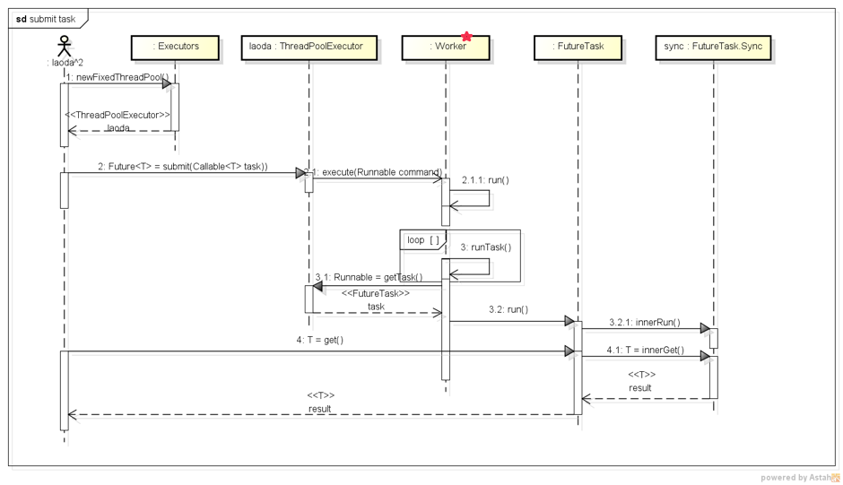
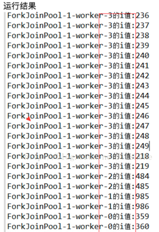
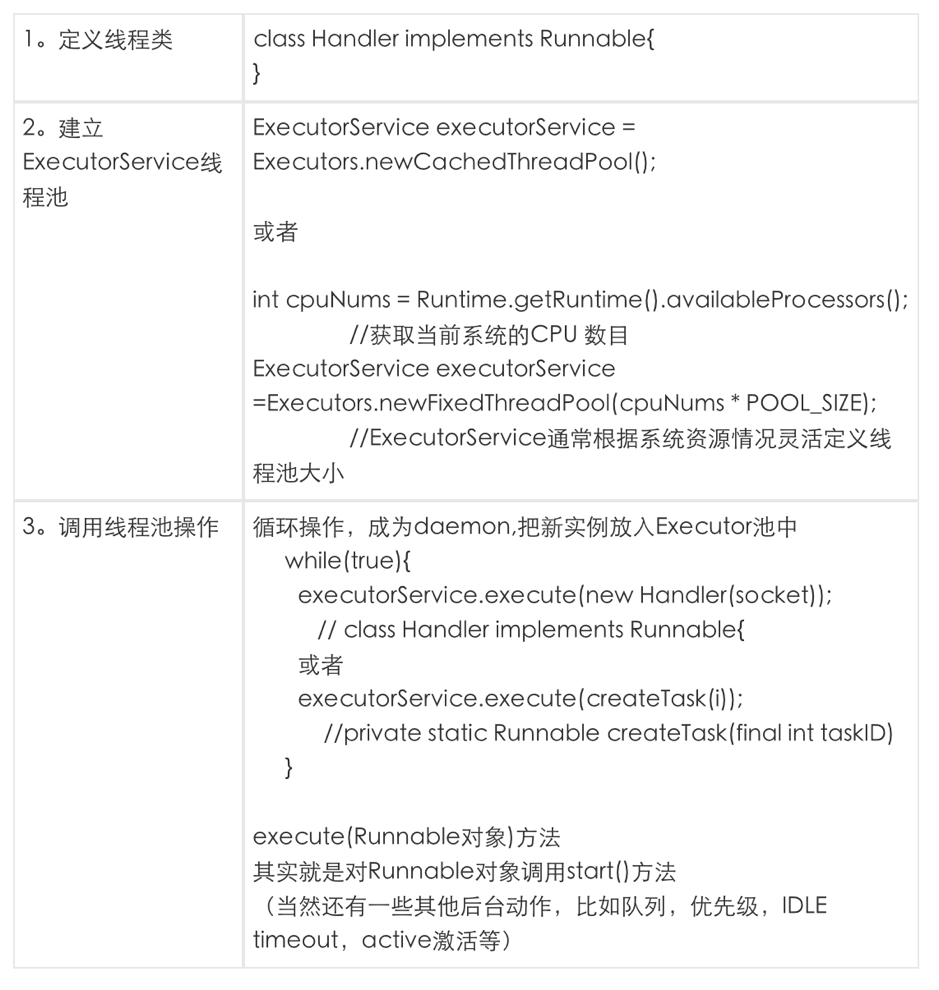

# <center>Thread Pool</center>


<br></br>

* 线程池内部，任务被插入阻塞队列，线程池里线程会去取队列任务。

* ForkJoinPool：
    * JDK1.7引入；
    * 大任务分割成小任务；
    * 工作窃取算法。

* ExecutorService：



* 使用工厂方法创建不同线程池。
* `workQueue`保存等待被执行的任务的阻塞队列，且任务须实现Runable接口。`workQueue`可以是ArrayBlockingQueue、LinkedBlockingQuene、SynchronousQuene、LinkedBlockingQuene或priorityBlockingQuene。
* 工作线程在`run()`方法中循环，从线程池领取可执行的task，调用task的`run()`方法执行。
* FutureTask的`run()`方法中调用内部类Sync的`innerRun()`方法执行具体任务，并把任务结果返回给FutureTask的`result`变量。

<br></br>


## ThreadPoolExecutor
----


<br></br>


## ForkJoinPool
----
* JDK1.7引入；
* 大任务分割成小任务；
* 工作窃取（work-stealing）算法。

为减少窃取任务线程和被窃取任务线程之间竞争，使用双端队列。被窃取任务线程从双端队列头部拿任务执行，窃取任务线程从双端队列尾部拿任务执行。

<br>


### 原理
由ForkJoinTask数组和ForkJoinWorkerThread数组组成。ForkJoinTask数组存放提交给ForkJoinPool的任务，而ForkJoinWorkerThread数组负责执行任务。调用ForkJoinTask的`fork()`方法时，会调用ForkJoinWorkerThread的`pushTask()`方法异步执行任务，然后返回结果：

```java
public final ForkJoinTask fork() {         
    ((ForkJoinWorkerThread) Thread.currentThread()).pushTask(this);         
    return this; 
} 
```

`pushTask()`把当前任务存放在ForkJoinTask数组queue里。然后再调用ForkJoinPool的`signalWork()`方法唤醒或创建一个工作线程执行任务：
```java
final void pushTask(ForkJoinTask t) {
    ForkJoinTask[] q; 
    int s, m;

    if ((q = queue) != null) {    // ignore if queue removed
        long u = (((s = queueTop) & (m = q.length - 1)) << ASHIFT) + ABASE;
        UNSAFE.putOrderedObject(q, u, t);
        queueTop = s + 1;         // or use putOrderedInt
        if ((s -= queueBase) <= 2)
            pool.signalWork();
        else if (s == m)
            growQueue();
    }
}
```

`join()`方法阻塞当前线程并等待获取结果：
```java
public final V join() {
    if (doJoin() != NORMAL) 
        return reportResult();
    else
        return getRawResult();
}

private V reportResult() {
    int s;
    Throwable ex;

    if ((s = status) == CANCELLED)
        throw new CancellationException();
    if (s == EXCEPTIONAL && (ex = getThrowableExcetpion()) != null)
        UNSAFE.throwException(ex);

    return getRawResult();
}
```

首先，调用`doJoin()`得到当前任务状态判断返回什么结果。任务状态有四种：
1. 已完成（NORMAL），则返回任务结果。
2. 被取消（CANCELLED），则抛出CancellationException。
3. 信号（SIGNAL）
4. 异常（EXCEPTIONAL），则抛出异常。

`doJoin()`方法：
```java
private int doJoin() {
    Thread t;
    ForkJoinThread w;
    int s;
    boolean completed;

    if ((t = Thread.currentThread()) instanceof ForkJoinWorkerThread) {
        if ((s = status) < 0)
            return s;

        if ((w = (ForkJoinWorkerThread)t).unpushTask(this)) {
            try {
                completed = exec();
            } catch (Throwable rex) {
                return setExceptionalCompletion(rex);
            }
            if (completed)
                return setCompletion(NORMAL);
        }
        return w.joinTask(this);
    } else {
        return externalAwaitDone();
    }
}
```

`doJoin()`首先通过查看任务状态，看任务是否已执行完。如果执行完则返回任务状态。如果没有则从任务数组取出任务并执行。如果任务顺利执行完成，则设置任务状态为NORMAL。如果出现异常，则纪录异常并将任务状态设置为EXCEPTIONAL。

<br>


### RecursiveAction Example（没有返回值）
* 任务类`PrintTask`统一用`compute()`方法负责计算子任务或任务分解成子任务；
* 每次分解调用类似`PrintTask.fork()`方法；
* 最后`ForkJoinPool.shutdown()`。

```java
class PrintTask extends RecursiveAction {
    private static final int MAX = 20; // 每个小任务最多只打印20个数
    private int start, end;

    PrintTask(int s, int e) {
        start = s; end = e;
    }

    @Override
    protected void compute() {
        // 当end - task值小于MAX时，开始打印
        if ((end - start) < MAX) {
            for (int i = start; i < end; i++) {
                System.out.println(Thread.currentThread().getName() + i);
            }
        } else {
            // 将大任务分解成两个小任务
            int middle = (start + end) / 2;
            PrintTask left = new PrintTask(start, middle);
            PrintTask right = new PrintTask(middle, end);
            // 并发执行两个小任务
            left.fork();
            right.fork();
        }
    }
}

public class ForkJoinPoolTest1 {
    public static void main(String[] args) throws Exception {
        // 创建包含Runtime.getRuntime().availableProcessors()返回值作为个数的并行线程池
        ForkJoinPool fjp = new ForkJoinPool();
        // 提交可分解的PrintTask任务
        fjp.submit(new PrintTask(0, 1000));
        fjp.awaitTermination(2, TimeUnit.SECONDS); // 阻塞当前线程直到ForkJoinPool中任务都执行完毕
        fjp.shutdown();
    }
}
```

计算机共4核，可以看到有4个worker：



<br>


### RecursiveTask Example（有返回值）

```java
class SumTask extends RecursiveTask<Integer> {
    private static final int MAX = 70; // 每个小任务最多只打印70个数
    private int arr[], start, end;

    SumTask(int[] a, int s, int e) {
        arr = a; start = s; end = e;
    }

    @Override
    protected Integer compute() {
        // 当end - task值小于MAX时，开始打印
        if ((end - start) < MAX) {
            for (int i = start; i < end; i++) {
                sum += arr[i];
            }

            return sum;
        } else {
            // 将大任务分解成两个小任务
            int middle = (start + end) / 2;
            SumTask left = new SumTask(arr, start, middle);
            SumTask right = new SumTask(arr, middle, end);
            // 并发执行两个小任务
            left.fork();
            right.fork();

            return left.join() + right.join();
        }
    }
}

public class ForkJoinPoolTest2 {
    public static void main(String[] args) throws Exception {
        int[] arr = new int[1000];
        Random ran = new Random();
        int total = 0;
        for (int i = 0; i < arr.length; i++) {
            int temp = ran.nextInt(100);
            total += (arr[i] = temp); // 计算初始化数据总和
        }
        // 创建包含Runtime.getRuntime().availableProcessors()返回值作为个数的并行线程池
        ForkJoinPool fjp = new ForkJoinPool();
        // 提交可分解的SumTask任务
        Future<Integer> future = fjp.submit(new SumTask(arr, 0, arr.length));
        System.out.println("Result = " + future.get());
        fjp.shutdown();
    }
}
```

<br></br>


## ExecutorService线程池
----
### 建立多线程步骤




### 四种线程池


### 工厂方法建立线程池
上面四种线程池都使用Executor的缺省线程工厂建立线程，也可单独定义自己的线程工厂。下面是缺省线程工厂代码:

```java
static class DefaultThreadFactory implements ThreadFactory {
    static final AtomicInteger poolNumber = new AtomicInteger(1);
    final ThreadGroup group;
    final AtomicInteger threadNumber = new AtomicInteger(1);
    final String namePrefix;

    DefaultThreadFactory() {
        SecurityManager s = System.getSecurityManager();
        group = (s != null) ? s.getThreadGroup() : Thread.currentThread().getThreadGroup();
        namePrefix = "pool-" + poolNumber.getAndIncrement() + "-thread- ";
    }

    public Thread newThread(Runnable r) {
        Thread t = new Thread(group, r, namePrefix + threadNumber.getAndIncrement(), 0);
        if (t.isDaemon())
            t.setDaemon(false);
        if (t.getPriority() != Thread.NORM_PRIORITY)
            t.setPriority(Thread.NORM_PRIORITY);

        return t;
    }
}
```

<br>


### 把Runnable实例加入pool
`execute()`将Runnable实例加入pool，并进行一些pool size计算和优先级处理。`execute()`在Executor接口中定义，有多个实现类都定义了不同的`execute()`方法。如ThreadPoolExecutor类（cache，fiexed和single三种池子都调用它）的`execute()`方法如下：

```java
public void execute(Runnable command) {
    if (command == null)
        throw new NullPointerException();

    if (poolSize >= corePoolSize || !addIfUnderCorePoolSize(command)) {
        if (runState == RUNNING && workQueue.offer(command)) {
            if (runStat != RUNNING || poolSize == 0)
                ensureQueuedTaskHandled(command);
        } else if (!addIfUnderMaximumPoolSize(command)) {
            reject(command); // is shutdown or saturated
        }
    }
}
```

ThreadPoolExecutor有两个最重要的集合属性，分别是存储接收任务的任务队列和用来干活的作业集合：
```java
// task queue
private final BlockingQueue<Runnable> workQueue;
// worker thread set
private final HashSet<Worker> workers = new HashSet<Worker>();
```

阻塞队列workQueue存储待执行任务，在构造线程池时可选择满足BlockingQueue定义的SynchronousQueue、LinkedBlockingQueue或DelayedWorkQueue等不同阻塞队列来实现不同特征的线程池。

<br>


### 执行任务
Worker负责执行任务：`private final class Worker implements Runnable`。在`run()`中作业线程调用`getTask()`获取任务，然后调用`runTask(task)`执行任务:

``` java
public void run() {
    try {
        Runnable task = firstTask;
        // 循环从线程池的任务队列获取任务
        while (task != null || (task = getTask()) != null) {
            runTask(task); // 执行任务
            task = null;
        }
    } finally {
        workerDone(this);
    }
}
```

`getTask()`是ThreadPoolExecutor提供给内部类Worker的方法。作用是从任务队列中取任务:
```java
Runnable getTask() {
    for (;;) {
        r = workQueue.take(); // 从任务队列头部取任务
        return r;
    }
}
```

`runTask(Runnable task)`是工作线程Worker真正处理每个具体任务:
```java
private void runTask(Runnable task) {
    // 调用任务的run方法，即在Worker线程中执行Task内定义的内容
    task.run();
}
```

其中的`task.run()`实际是FutureTask的`run()`方法。FutureTask委托内部定义的Sync类，Sync继承自AQS，维护任务状态。

<br>


### 总结


1. 首先创建一个任务执行服务ExecutorService，使用工具类Executors工厂方法创建不同的线程池`ThreadPoolExecutor；
2. 线程池是负责把任务封装成FutureTask对象，并根据输入定义好要获得结果的类型，就可以`submit()`任务了。
3. 线程池接收输入的task，根据需要创建工作线程，启动工作线程来执行task。
4. 工作线程在其`run()`方法中一直循环，从线程池领取可以执行的task，调用task的`run()`方法执行task的任务。
5. FutureTask的`run()`方法中调用内部类Sync的`innerRun()`方法执行具体任务，并把任务的执行结果返回给FutureTask的`result`变量。
6. 当提及任务的角色调用FutureTask的`get()`方法获取执行结果时，Sync的`innerGet()`方法被调用。根据任务的执行状态判断，任务执行完毕则返回执行结果；未执行完毕则等待。
