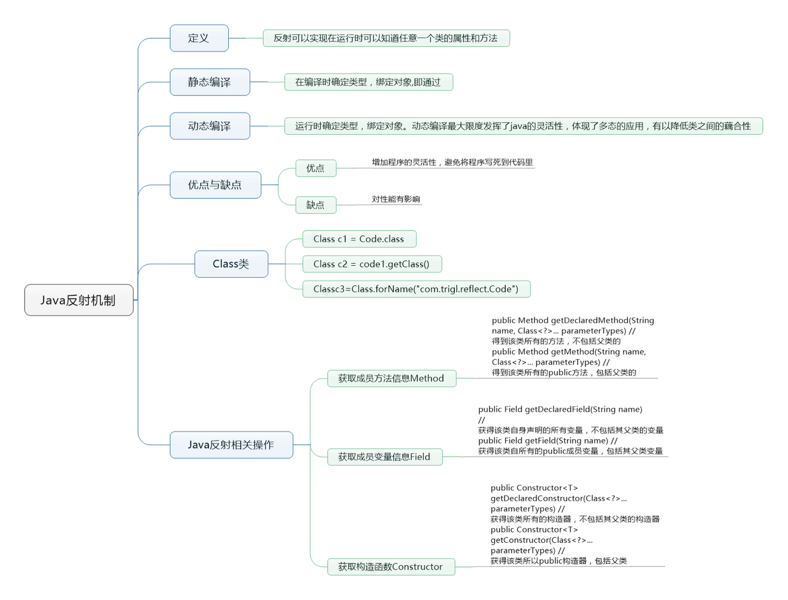
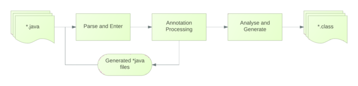

# <center>Annotation & Refelection</center>

<br></br>


## Refelction
----
<p align="center">
  
</p>

<br></br>


## Annotation
----
<p align="center">
  
</p>

概念：
* 是1.5引入的特性，与类、接口和枚举在同一层次。
* 注解即源代码元数据。
* 注解在代码中添加信息提供形式化方法，可在后续中方便使用这些数据。
* 注解是应用于类、方法、参数、变量、构造器及包声明的特殊修饰符。

作用：
1. 生成文档。
2. 跟踪代码依赖性，实现替代配置文件功能，减少配置。如Spring中注解。
3. 编译时格式检查，如`@Override`。
4. 每当创建描述符性质的类或接口时，一旦包含重复性工作，可使用注解简化与自动化过程。
5. 编译时动态处理，动态生成代码。
6. 运行时动态处理，获得注解信息。

<br>


### 注解工作流程
1. 在编译时处理。
2. 注解处理器（Annotation Processor）读取代码处理相应注解，且生成对应代码。
3. 生成的代码被当做普通Java类再次编译。
4. 注解处理器不能修改已存在的Java文件，也不能对方法做修改或添加。

<p align="center">
  
</p>

<br>


### 内置注解
Java三个内置注解：
1. `@Override` - 当前方法定义将覆盖超类中方法。如果出现错误，编译器会报错。

    当子类覆写父类方法时，使用这个注解，一定程度提高可读性，也避免维护的一些问题。比如，当修改父类方法签名，有很多个子类方法签名也须修改。当类越来越多时，这个注解会帮上忙。

2. `@Deprecated` - 如果使用此注解，编译器会出现警告信息。
3. `@SuppressWarnings` - 忽略编译器警告信息。

<br>


### 元注解
作用是注解其他注解。

Java定义的6个元注解（前4个5.0引入，后两个8.0引入）：
1. `@Target` - 描述注解的使用范围。

    注解可用于packages、types（类、接口、枚举和注解类型）、类型成员（方法、构造方法、成员变量和枚举值）、方法参数和本地变量（如循环变量）。在注解类型声明中使用target可明晰其修饰的目标。

2. `@Retention` - 表示需要在什么级别保存该注释信息，用于描述注解的生命周期。

    某些注解仅出现在源码中，而被编译器丢弃；另一些被编译在class文件中。编译在class文件的注解可能被虚拟机忽略；而另一些在class装载时被读取。这个注解可对注解生命周期限制。

3. `@Documented` - 将注解包含在javadoc中。
4. `@Inherited` - 允许子类继承父类中的注解。
5. `@Repeatable` - 元注解，表示被修饰的注解可用在同一个声明式或类型加上多个相同类型注解。
6. `@Native` - 元注解，本地方法。

<br>


### 自定义注解
创建自定义注解与写接口相似，除了接口关键字前有个`@`符号。

定义：
```java
@Retention(RetentionPolicy.RUNTIME)
@Target(ElementType.FIELD)
public @interface Example{
    public static String STRING_DATA = "String";
    public String name() default "New Example";
    public String description();
    public int id() default 0;
}
```

使用：
```java
@Example(name = "ExampleData" , description = "Simple Description")
public static int dataexample = 1;
```

* 注解方法不能有参数。
* 注解方法返回类型局限于原始类型，字符串，枚举，注解，或以上类型构成的数组。
* 注解方法可包含默认值。
* 注解可包含与其绑定的元注解，元注解为注解提供信息。


<br></br>


## 注解与反射
----
`Status`类：
```java
public class Status {
@IConfig(name = "ontime.starttime", type = IConfig.DInteger)
public static int data = 1;
public static final int d = 2;
}
```

`IConfig`类：
```java
import java.lang.annotation.ElementType;
import java.lang.annotation.Retention;
import java.lang.annotation.RetentionPolicy;
import java.lang.annotation.Target;
 
@Target(ElementType.FIELD)
@Retention(RetentionPolicy.RUNTIME)
public @interface IConfig {
    public String name();
    public String type();
    public static String DInteger = "Integer";
    public static String DDouble = "Double";
    public static String DString = "String";
    public static String DLong = "Long";
    public static String DChar = "Character";
}
```

反射`Status`类中全部变量。如果有`IConfig`注解，输出注解内容，且给出通过反射修改变量值：
```java
public static void main(String[] args) throws ClassNotFoundException, IllegalArgumentException, IllegalAccessException, NoSuchMethodException, SecurityException, InvocationTargetException{
    Class<?> cls = Class.forName("cn.sunflyer.test.Status"); // 加载类
    Field fs[] = cls.getFields(); // 获取类中全部公开变量
    if(fs != null){
        for(Field x:fs){
            System.out.println("名称 " + x.getName() + " 修饰符 " + x.getModifiers());
            Annotation rms = x.getAnnotation(IConfig.class);
            if(rms != null){  // 如果获取到IConfig注解，输出内容并根据注解动态修改数据。
                IConfig ic = (IConfig)rms;
                System.out.println("注解 name : " + ic.name());
                System.out.println("注解 type : " + ic.type());
                String da = "1234";
                Object ras = null;
                if(ic.type().equals(IConfig.DString)){
                    ras = da;
                }else{
                    Class<?> fCls = Class.forName("java.lang." + ic.type()); // 加载JAVA基本数据类型的封装对象类。
                    Method ms = fCls.getMethod("valueOf", String.class); // 获取指定方法。
                    ras = ms.invoke(null , da); // 调用方法。
                }
                x.set(null, ras);
            }
        }
    }
}
```