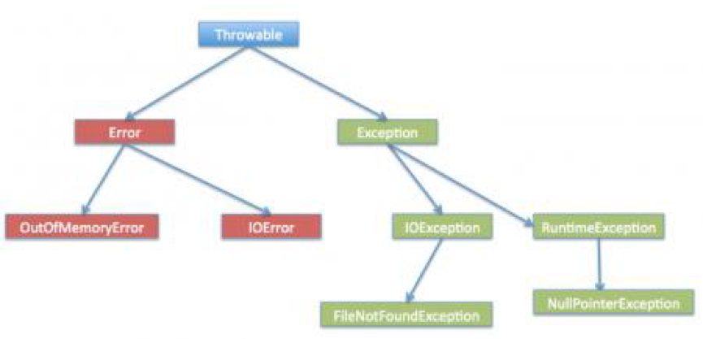

# <center>Fundanmental</center>

<br></br>


## 常用类型
----

|   类型   | 存储需求  | bit数  |    存储数据量       |        取值范围   |
| :-----: | :------: | :----: | :--------------: | :-----------------: |
| byte    | 1字节     | 1 * 8  |  256=$$2^{8}$$   | -128 ~ 127         |
| short   | 2字节     | 2 * 8  | 65536=$$2^{16}$$ | -32768 = $$-2^{15}$$ ~ 32767 = $$2^{15} - 1$$ |
| int     |  4字节    | 4 * 8  | $$2^{32} $$      | $$-2^{31}$$ ~ $$2^{31} - 1$$ (0x8000 0000 ~ 0x7FFF FFFF) |
| long    |  8字节    | 8 * 8  | $$2^{64}$$       | $$-2^{63}$$ ~ $$2^{63} - 1$$ |
| float   | 4字节     | 4 * 8  |                  | float类型数值有一个后缀F(例如：3.14F) |
| double  | 8字节     | 8 * 8  |                  |                    |
| char    | 2字节     | 2 * 8  |                  |                      |
| boolean | 1字节     | 1 * 8  |                  |                     |

ASCII码：
``` java
public class ASCII {
	public static void main(String[] args) {
		System.out.println('A' - 65);
		System.out.println('Z' - 90);
		System.out.println('a' - 97);
	}
}
```

<br></br>


## FAQ
----
* 已知Integer a = 127; Integer b = 127; Integer c = 128; Integer d = 128; 求a == b与c == d。

    a == b true  c == d false
    Integer内部有-128到127的缓存池，a和b都使用常量池，超过了就在堆上分配空间。所以c和d在堆上地址不一样，为false。

<br></br>


## Object Methods
----
* toString
* equals 
* getClass
* hashCode
* notify
* notifyAll
* wait

<br></br>


## String vs StirngBuilder vs StringBuffer
----
区别：
* String继承Object类，SrtringBuilder和StringBuffer继承AbstractStringBuilder类。
* String是不可变类，可用作HashMap的key，但StringBuilder和StringBuffer不行。
* 因为String不可变，StringBudiler线程不安全，StringBuffer线程安全，所以执行效率是String < StringBuffer < StringBudiler。

适用情况：
* String适用少量字符串操作。
* StringBuilder适用单线程在字符缓冲区大量操作。
* StringBuffer适用多线程在字符缓冲区大量操作。

<br></br>


## 逻辑运算符
----
* `&`，两个操作数中位都为1则为1，否则0。
* `|`, 两个位只要有一个为1就是1。
* `~`，自反。~a
* `^`，异或，两个操作数的位相同则为0，否则为1。

<br></br>


## newInstance vs new
----
* `newInstance()`是方法，`new`是关键字。
* 创建对象的方式不一样，前者是使用类加载机制，后者是创建一个新类。 
* 使用`new`创建类时，这个类可以没有被加载。但用`newInstance()`方法须保证已加载且这个类已经连接。而完成上面两个步骤的是`Class`的静态方法`forName()`，调用了启动类加载器，即加载Java API的那个加载器。 
* `newInstance()`是把`new`分解为两步，先调用`Class`加载方法加载某个类，然后实例化。 

<br></br>


## for vs foreach
----
1. foreach遍历集合时，集合须实现Iterator接口。
2. foreach遍历集合时不能向集合增加删除元素，否则会抛出ConcurrentModificationException异常。
3. for效率最好，尤其是实现RandomAccess接口的collection。
4. foreach遍历对象时可以修改对象属性值，但不能修改对象引用。

<br></br>


## Copy
----
### Shallow Copy 浅拷贝


浅拷贝是按位拷贝对象，会创建一个新对象。如果原始对象属性是基本类型，拷贝的就是基本类型的值；如果原始对象属性是内存地址（引用类型），拷贝的就是内存地址 ，因此如果其中一个对象改变了这个地址，就会影响到另一个对象。

图中，`SourceObject`有一个int类型的属性 `field1`和一个引用类型属性`refObj`。对`SourceObject`浅拷贝时，创建了`CopiedObject`。由于`field1`是基本类型，所以将它的值拷贝给`field2`，但由于`refObj`是引用类型, 所以`CopiedObject`指向`refObj`相同的地址。因此对`SourceObject`中的`refObj`所做的任何改变都会影响到`CopiedObject`。

```java
public class Subject {
    private String name; 

    public Subject(String s) { 
      name = s; 
   } 
}

public class Student implements Cloneable { 
   private Subject subj;  // 对象引用
   private String name; 

   public Student(String s, String sub) { 
      name = s; 
      subj = new Subject(sub); 
   } 

   // 重写clone()方法, 浅拷贝
   public Object clone() { 
      try { 
         return super.clone();  // 直接调用父类clone()方法
      } catch (CloneNotSupportedException e) { 
         return null; 
      } 
   } 
}
```

<br>


### Deep Copy
深拷贝会拷贝所有的属性。通过序列化进行深拷贝时，须确保对象图中所有类都可序列化。


```java
public class Student implements Cloneable { 
   private Subject subj;  // 对象引用 
   private String name; 

   public Student(String s, String sub) { 
      name = s; 
      subj = new Subject(sub); 
   } 

   // 重写clone()方法 
   public Object clone() { 
      // 深拷贝，创建拷贝类的一个新对象，和原始对象相互独立
      Student s = new Student(name, subj.getName()); 
      return s; 
   } 
}
```

<br>


### 延迟拷贝
浅拷贝和深拷贝的组合。开始拷贝对象时，使用速度较快的浅拷贝，还会用计数器记录有多少对象共享这个数据。修改原始对象时，它会决定数据是否被共享（通过检查计数器）并根据需要进行深拷贝。在某些情况下, 循环引用会导致问题。

<br></br>


## final vs finally vs finalize
----
* `final` and `finally` are keywords whereas `finalize` is a method. 
* `final` can be used with class variables so that they can’t be reassigned, with class to avoid extending by classes and with methods to avoid overriding by subclasses. `finally` keyword is used with try-catch block. `finalize` method is executed by GC before the object is destroyed.

`final`：
* Class: no other class can extend it. 
* Method: child classes can’t override it.
* Variable: 如果是基本数据类型，则数值初始化后不能更改；如果是引用类型，则初始化后不能指向另一个对象。

<br></br>


## static
----
* 变量: A static variable is a class variable and doesn’t belong to Object instance of the class.

* 方法: **Same as static variables. A static method can access only static variables of class and invoke only static methods of the class. 即使没有声明为static，类构造器也是静态方法。**

* Class: We can use static keyword with nested classes. static keyword can’t be used with top-level classes.

<br></br>


## Override vs Overload
----
> Override重写，子类对父类； Overload重载，一个类里面。

重写Override规则：
* 参数列表完全与被重写方法相同；
* 返回类型完全与被重写方法返回类型相同；
* 访问权限不能比父类中被重写方法的访问权限低。
* 父类成员方法只能被子类重写。
* 构造函数、`final`和`static`方法不能被重写。
* 重写方法能抛出任何非强制异常，无论被重写的方法是否抛出异常。但重写方法不能抛出新强制性异常，或比被重写方法声明的更广泛的强制性异常，反之则可以。
* 如果不能继承一个方法，则不能重写这个方法。

重载Overload规则：
* 被重载方法须改变参数列表；
* 被重载方法可改变返回类型；
* 被重载方法可声明新的或更广的检查异常；
* 方法能在同一个类中或子类中被重载。

重写与重载区别：

| 区别点   | 重载Overload | 重写Override  |
| ------- | ----------- | ---------- |
| 参数列表 | 必须修改      |  不能修改   |
| 返回类型 |  可以修改     |  不能修改 |
| 异常    |   可以修改     | 可以减少，但不能抛出新的或更广的异常  |
| 访问    |   可以修改     | 可以降低限制，但不能做更严格限制  |

<br></br>


## Collection vs Collections
----
* Collection - 集合类上级接口，继承与他的接口主要有Set和List。
* Collections - 针对集合类的帮助类，提供静态方法实现对各种集合的搜索、排序、线程安全化等操作。

<br></br>


## Exception Hierarchy
----
* *Errors*: out of scope of application and it’s not possible to anticipate and recover from them, for example hardware failure, JVM crash or OOM error. 

* *Checked Exceptions*: we can anticipate in a program and try to recover from it, for example `FileNotFoundException`. Exception is the parent class of all Checked Exceptions. 

* *Runtime Exceptions:* caused by bad programming, for example `ArrayIndexOutOfBound` exception at runtime. RuntimeException is the parent class of all runtime exceptions.

<p align="center">
  
</p>

<br>