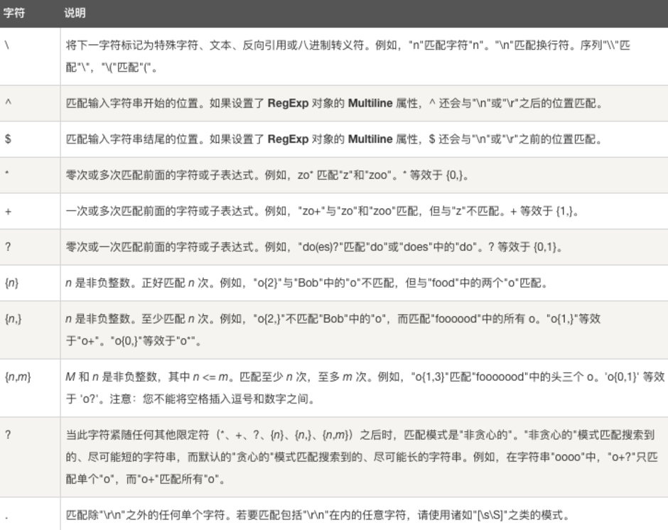

# <center>Practics</center>

<br></br>


## Serializable
----

```java
public class  Box implements Serializable  {  
    private int width;  
    private int height;  
  
    public void setWidth(int width) {this.width  = width;}  

    public void setHeight(int height) {this.height = height;}  
  
    public static void main(String[] args){  
        Box myBox = new Box();  
        myBox.setWidth(50);  
        myBox.setHeight(30);  
  
        try{  
            FileOutputStream fs = new FileOutputStream("foo.ser");  
            ObjectOutputStream os =  new ObjectOutputStream(fs);  
            os.writeObject(myBox);  
            os.close();  
        }catch(Exception ex){  
            ex.printStackTrace();  
        }  
    }     
} 
``` 

<br></br>


## super
----
Invoke super class constructor in child class constructor but in this case it should be the first statement in the constructor method.

``` java
public class SuperClass { 
    public SuperClass(){ } 

    public void test(){ 
        System.out.println("super class test method"); 
    } 
} 
```

Use of super keyword can be seen in below child class implementation.

``` java
public class ChildClass extends SuperClass { 
    public ChildClass(String str){ 
        //access super class constructor with super keyword 
        super(); 
        //access child class method 
        test(); 
        //use super to access super class method 
        super.test(); 
    } 

    @Override 
    public void test(){ 
        System.out.println("child class test method"); 
    } 
}
```

<br></br>


## 抽象方法
----
如果想设计这样一个类，该类包含一个特别的成员方法，该方法具体实现由子类确定，那么可在父类中声明该方法为抽象方法。抽象方法没有定义，方法名后面直接跟一个分号，而不是花括号。

``` java
public abstract class Employee{
   private String name;
   private String address;
   private int number;
   
   public abstract double computePay();
}
```

声明抽象方法会造成以下两个结果：
* 如果一个类包含抽象方法，那么该类必须是抽象类。
* 任何子类必须重写父类的抽象方法，或者声明自身为抽象类。

如果Salary类继承Employee类，那么须实现`computePay()`方法：
``` java
public class Salary extends Employee {
   private double salary; // Annual salary
  
   public double computePay() {
      System.out.println("Computing salary pay for " + getName());
      return salary/52;
   }
}
```

<br></br>


## Exception
---- 
### Keywords 
1. `throw`: Sometimes we explicitly want to create exception object and then throw it to halt the normal processing of the program. `throw` keyword is used to throw exception to the runtime to handle it. 

2. `throws`: When we are throwing any checked exception in a method and not handling it, then we need to use throws keyword in method signature to let caller program know the exceptions that might be thrown by the method. 

3. `try-catch`: We can have multiple catch blocks with a try and try-catch block can be nested also. catch block requires a parameter that should be of type Exception.

4. `finally`: Used only with try-catch block. 

<br>


### Exception Hierarchy
* *Errors*: out of scope of application and it’s not possible to anticipate and recover from them, for example hardware failure, JVM crash or out of memory error. 

* *Checked Exceptions*: we can anticipate in a program and try to recover from it, for example `FileNotFoundException`. Exception is the parent class of all Checked Exceptions. 

* *Runtime Exceptions:* caused by bad programming, for example `ArrayIndexOutOfBound` exception at runtime. RuntimeException is the parent class of all runtime exceptions.

<p align="center">
  
</p>

<br>


### 自定义Exception

```java
public class CustomException extends RuntimeException {  
    private static final long serialVersionUID = 1L;
	private String retCd ;  //异常对应的返回码  
    private String msgDes;  //异常对应的描述信息  
      
    public CustomException() {  
        super();  
    }  
  
    public CustomException(String message) {  
        super(message);  
        msgDes = message;  
    }  
  
    public CustomException(String retCd, String msgDes) {  
        super();  
        this.retCd = retCd;  
        this.msgDes = msgDes;  
    }  
  
    public String getRetCd() {  
        return retCd;  
    }  
  
    public String getMsgDes() {  
        return msgDes;  
    }  
}  
```

<br></br>


## 父类和子类的构造函数
----
``` java
class Super {
    String s;

    public Super(String s) {
        this.s = s;
    }
}

public class Sub extends Super {
    int x = 200;
    public Sub(String s) {} // error
    public Sub(){} // error
}
```

出现编译错误因为默认的父类构造函数未定义。如果一个类没有定义构造函数，编译器会默认插入一个默认的无参数构造函数。如果程序员定义构造函数，编译器将不插入默认的无参数构造函数。上面的代码由于自定义了有参数的构造函数，编译器不再插入无参数的构造函数。子类的构造函数，无论是有参数或无参数，都将调用父类无参构造函数。当子类需要父类的无参数构造函数的时候，就发生了错误。

解决这个问题，可以增加一个父类构造函数:
``` java
public Super() {}
```

<br></br>


## 范型
----
* 泛型的类型参数只能是类类型（包括自定义类），不能是简单类型。
* 泛型的参数类型可以使用extends语句，例如`<T extends superclass>`。
* 泛型的参数类型还可以是通配符类型。例如`Class<?> classType = Class.forName(java.lang.String);`

<br>


### 范型类
``` java
public class Gen<T> {
    private T t;
    public Gen(T t) {
        this.t = t;
    }
}

Gen<Integer> gen2=new Gen<Integer>(1);
```

<br>


### 范型方法
须在方法的修饰符（public, static, final, abstract）后，返回值声明前:
* 正确：`public static <E> void printArray(E[] a)`
* 错误：`public static void <E> printArray(E[] a)`

<br></br>


## 相对路径读取文件
----
java project环境，使用java.io用相对路径读取文件的例子：
```
目录结构：
  DecisionTree
            |___src
                 |___com.decisiontree.SamplesReader.java
            |___resource
                 |___train.txt,test.txt
```

SamplesReader.java:
``` java
String filepath = "resource/train.txt"; //注意filepath的内容；
File file = new File(filepath);
```

java.io默认定位到当前用户目录下，即工程根目录`D:\DecisionTree`。此时的相对路径为`resource/train.txt`。这样，JVM就可以根据`user.dir`与`resource/train.txt`得到完整的路径（即绝对路径）`D:\DecisionTree\resource\train.txt`。

<br></br>


## IO
---- 
### Writer和Reader
Writer和Reader用于字符流的写入和读取，也就是说写入和读取的单位是字符，如果读与写的操作不涉及字符，那么是不需要Writer和Reader的。 
* Writer类（抽象类），子类必须实现的方法仅有`write()`、`flush()`和`close()`。
* Reader类（抽象类），子类必须实现的方法仅有`read()`和`close()`。
* `write()`方法是将数据写入到文件（广义概念，包括字节流什么的）中。
* `read()`方法是将文件（广义概念，包括字节流什么的）中的数据读出到缓冲目标上。 
 
<br>


### InputStream和OutputStream
* InputStream是表示字节输入流的所有类的超类。字节输入流相当于是一个将要输入目标文件的“流”。InputStream有 read() 方法而没有write()方法，因为它本身代表将要输入目的文件的一个“流” 
* OutputStream：此抽象类是表示输出字节流的所有类的超类。输出流接受输出字节并将这些字节发送到某个接收器。是从文件中将要输出到某个目标的“流”。OutputStream有 write()方法而没有read()方法。
* InputStreamReader是字节流通向字符流的桥梁：它使用指定的 charset 读取字节并将其解码为字符。它使用的字符集可以由名称指定或显式给定，或者可以接受平台默认的字符集。 
* OutputStreamWriter是字符流通向字节流的桥梁：可使用指定的 charset 将要写入流中的字符编码成字节。它使用的字符集可以由名称指定或显式给定，否则将接受平台默认的字符集。

BufferReader和BufferWriter：缓冲机制是说先把数据存到缓冲内存中，再一次写入文件，减少打开文件的消耗。

<br>


### 读写文件?

``` java
//读文件:
FileInputStream fin = new FileInputStream("e:\\tt.txt"); 
byte[] bs = new byte[100];

while(true){ 
          int len = fin.read(bs);
          if(len <= 0) 
              break;
          System.out.print(new String(bs,0,len));
}

fin.close();
```

``` java
//写文件:
FileWriter fw = new FileWriter("e:\\test.txt");

fw.write("hello world!" + System.getProperty("line.separator")); 
fw.write("你好!北京!"); 
fw.close(); 
```

<br></br>


## 文件目录操作
----
### 列出目录下所有文件 

``` java
File file = new File("e:\\总结"); 
File[] files = file.listFiles(); 
for(int i=0; i<files.length; i++) { 
    if(files[i].isFile()) 
        System.out.println(files[i]);
}
```

<br>


### 列出目录下的所有子目录

``` java
File file = new File("e:\\总结"); 
File[] files = file.listFiles(); 
for(int i=0; i<files.length; i++){ 
    if(files[i].isDirectory()) 
        System.out.println(files[i]);
}
```

<br>


### 判断一个文件或目录是否存在
创建`File`对象,调用其`exsit()`方法即可返回是否存在,如: ``System.out.println(new File("d:\\t.txt").exists());``

<br></br>


## Comparable vs Comparator
----
### Comparable定义在Person类的内部

```java
public class Persion implements Comparable {
    // 比较Person的大小
    // Collections.sort(personList)可以得到正确结果
}
```

<br>


### Comparator定义在Person外部
此时`Person`类结构不需要有任何变化,如
```java
public class Person{ String name; int age }
```

然后另外定义一个比较器:
``` java
public PersonComparator implements Comparator() {
    // 比较Person的大小
}
```

当要对`personList`排序时, 除了要传递`personList`, 还要把`PersonComparator`传过去, 如:

```java
Collections.sort(personList , new PersonComparator());
```

<br>


### Comparable Example

```java
public class PersonComparable implements Comparable<PersonComparable>{
    private int age;
    private String name;
    
    public int compareTo(PersonComparable another) {
        if (another != null)
            return age - another.getAge();
        else
            throw new NullPointerException();
   }
}

public static void main(String[] args) {
        PersonComparable[] pArr = new PersonComparable[2];
        pArr[0] = new PersonComparable("test1", 26);
        pArr[1] = new PersonComparable("test2", 19);
        Arrays.sort(pArr);
}
```

<br>


### Comparator Example

```java
public class PersonComparator implements Comparator<Person>{
    public int compare(Person p1, Person p2){
        if(p1 != null && p2 != null)
            return p1.getAge() - p2.getAge();
        else
            throw new NullPointerException();
    }
}

public static void main(String[] args) {
        Person[] pArr = new Person[2];
        pArr[0] = new Person("test1", 26);
        pArr[1] = new Person("test2", 19);
        Arrays.sort(pArr, new PersonComparator());
}
```

<br></br>


## Regular Expression
----


<br></br>


## List中的迭代器
----
```java
private class Itr implements Iterator<E> {
        int cursor = 0;
        int lastRet = -1;
        int expectedModCount = modCount;

        public boolean hasNext() {
            return cursor != size();
        }

        public E next() {
            checkForComodification();
            try {
                int i = cursor;
                E next = get(i);
                lastRet = i;
                cursor = i + 1;
                return next;
            } catch (IndexOutOfBoundsException e) {
                checkForComodification();
                throw new NoSuchElementException();
            }
        }

        public void remove() {
            if (lastRet < 0)
                throw new IllegalStateException();
            checkForComodification();

            try {
                AbstractList.this.remove(lastRet);
                if (lastRet < cursor)
                    cursor--;
                lastRet = -1;
                expectedModCount = modCount;
            } catch (IndexOutOfBoundsException e) {
                throw new ConcurrentModificationException();
            }
        }

        final void checkForComodification() {
            if (modCount != expectedModCount)
                throw new ConcurrentModificationException();
        }
}
```

<br></br>


## Static Import
----
If we have to use any static variable or method from other class, usually we import the class and then use the method/variable with class name.
```java
import java.lang.Math;
//inside class
double test = Math.PI * 5;
```

We can do the same thing by importing the static method or variable only and then use it in the class as if it belongs to it.
```java
import static java.lang.Math.PI;
//no need to refer class now
double test = PI * 5;
```
Use of static import can cause confusion, so it’s better to avoid it. 

<br></br>


## Java Annotations
----
Java Annotations provide information about the code and they have no direct effect on the code they annotate. Annotations are introduced in Java 5. Annotation is metadata about the program embedded in the program itself. It can be parsed by the annotation parsing tool or by compiler. We can also specify annotation availability to either compile time only or till runtime also. Java Built-in annotations are `@Override`, `@Deprecated` and `@SuppressWarnings`.

<br></br>


## Why can’t we create generic array? 
----
We are not allowed to create generic arrays because array carry type information of it’s elements at runtime. This information is used at runtime to throw ArrayStoreException if elements type doesn’t match to the defined type. Since generics type information gets erased at runtime by Type Erasure, the array store check would have been passed where it should have failed. 

```java
List<Integer>[] intList = new List<Integer>[5]; // compile error
Object[] objArray = intList;
List<Double> doubleList = new ArrayList<Double>();
doubleList.add(Double.valueOf(1.23));
// this should fail but it would pass because at runtime intList and doubleList both are just List
objArray[0] = doubleList; 
```
Arrays are covariant by nature i.e `S[]` is a subtype of `T[]` whenever S is a subtype of T but generics doesn’t support covariance or sub-typing as we saw in last question. So if we would have been allowed to create generic arrays, because of type erasure we would not get array store exception even though both types are not related.

<br></br>


## Daemon Thread
----
Thread class `setDaemon(true)` can be used to create daemon thread in java. We need to call this method before calling `start()` method else it will throw IllegalThreadStateException.

<br></br>


## Important Methods of Exception Class
----
Exception and all of its subclasses doesn’t provide any specific methods and all of the methods are defined in the base class Throwable.
1. `String getMessage()` – returns the message String of Throwable and the message can be provided while creating the exception through it’s constructor.
2. `String getLocalizedMessage()` – is provided so that subclasses can override it to provide locale specific message to the calling program. Throwable class implementation of this method simply use getMessage() method to return the exception message.
3. `synchronized Throwable getCause()` – returns the cause of the exception or null id the cause is unknown.
4. `String toString()` – returns the information about Throwable in String format, the returned String contains the name of Throwable class and localized message.
5. `void printStackTrace()` – prints the stack trace information to the standard error stream, this method is overloaded and we can pass PrintStream or PrintWriter as argument to write the stack trace information to the file or stream.

<br></br>


## JDBC
----
* Statement用于执行静态SQL语句并返回它所生成结果的对象，在执行时确定sql。
* PreparedStatement表示预编译的SQL语句对象。
* CallableStatement用于执行SQL存储过程的接口。如果有输出参数要注册说明是输出参数。

连接Oracle数据库：
```java
Class.forName(“oracle.jdbc.driver.OracleDriver”);
Connection con=DriverManager.openConnection(“jdbc:oracle:thin:@localhost:1521:DataBase ”,” UserName”,”Password ”)
```
利用JDBC检索出表中的数据：
```java
Class.forName(“”);
Connection con=DriverManager.openConnection(“ ”,” ”,” ”)
preparedStatment  ps=Con.preparedStatment(“select * from ［table］”);
ResultSet rs=ps.executeQuery();
while(rs.next){
	Rs.getString(1) 或rs.getString(“字段名”)
}
```

<br></br>