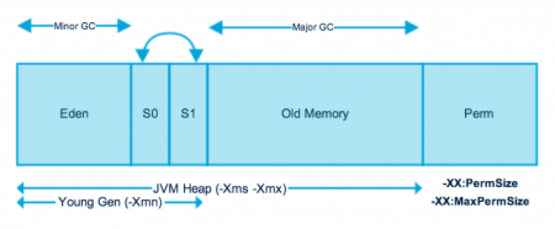

# Garbage Collector

## 1. GC收集算法 
### 1.1 标记-清除(Mark-Sweep)

&#12288;&#12288;收集器先从根开始访问所有活跃对象，标记为活跃对象。然后再遍历一次整个内存区域，把所有没有标记活跃的对象进行回收处理。

&#12288;&#12288;标记-清除算法实现起来比较容易，但容易产生内存碎片，碎片太多会导致后续过程中需要为大对象分配空间时无法找到足够的空间而提前触发新的一次GC。

&#12288;&#12288; 

<br></br>

### 1.2 复制(Copying)

&#12288;&#12288;为了解决Mark-Sweep算法的缺陷，Copying算法就被提了出来。将堆内分成两个相同空间，从根(ThreadLocal的对象，静态对象)开始访问每一个关联的活跃对象，将空间A的活跃对象全部复制到空间B，然后一次性回收整个空间A。 因为只访问活跃对象，将所有活动对象复制走之后就清空整个空间，不用去访问死对象，所以实现简单，运行高效且不容易产生内存碎片，但对内存空间的使用做出了高昂的代价，因为能够使用的内存缩减到原来的一半。

&#12288;&#12288;显然，Copying算法的效率跟存活对象的数目多少有很大的关系，如果存活对象很多，那么Copying算法的效率将会大大降低。

&#12288;&#12288; 

<br></br>

### 1.3 标记-整理(Mark-Sweep-Compact)

&#12288;&#12288;为了解决Copying算法缺陷，提出了Mark-Sweep-Compact算法。综合了上述两者的做法和优点，先标记活跃对象，在完成标记之后，不直接清理可回收对象，而是将存活对象向一端移动，然后清理掉端边界以外的内，将其合并成较大的内存块.

&#12288;&#12288; 

<br></br>

### 1.4 分代收集(Generational Collection)

 

#### 1.4.1 新生代(Young)

 

&#12288;&#12288;新建的对象都是用新生代分配内存，新生代又进一步分为Eden和Survivor区，Survivor由FromSpace和ToSpace组成。

&#12288;&#12288;Eden空间不足的时候，会把存活的对象转移到Survivor中。新生代通常存活时间较短，因此基于复制收集算法来进行回收，就是在Eden和FromSpace或ToSpace之间copy。`-XX:NewRatio=`参数可以设置Young与Old的大小比例，`-XX:SurvivorRatio=`参数可以设置Eden与Survivor的比例.

&#12288;&#12288;新生代又被进一步划分为Eden和Survivor区，最后Survivor由FromSpace和ToSpace组成.

&#12288;&#12288;两个存活区中始终有一个是空白的。在进行GC时，Eden和其中一个非空存活区中还存活的对象根据其存活时间被复制到当前空白的存活区或年老世代中。经过这一次的复制之后，之前非空的存活区中包含了当前还存活的对象，而Eden和另一个存活区中的内容已经不再需要了，只需把这两个区域清空即可。下一次GC时，这两个存活区的角色就发生了交换。

&#12288;&#12288;新生代采用空闲指针的方式来控制GC触发，指针保持最后一个分配的对象在新生代区间的位置，当有新的对象要分配内存时，用于检查空间是否足够，不够就触发GC(minor GC)。当连续分配对象时，对象会逐渐从Eden到Survivor，最后到旧生代. 

&#12288;&#12288;对于新生代都采取Copying算法，因为新生代中每次垃圾回收都要回收大部分对象，也就是说需要复制的操作次数较少，但是实际中并不是按照1：1的比例来划分新生代的空间的。一般是将新生代划分为一块较大的Eden空间和两块较小的Survivor空间，每次使用Eden空间和其中的一块Survivor空间，当进行回收时，将Eden和Survivor中还存活的对象复制到另一块Survivor空间中，然后清理掉Eden和刚才使用过的Survivor空间。

> 年轻代的痛：由于对年轻代的复制收集，须停止所有线程。只能靠多CPU，多线程并发来提高收集速度。所以，暂停时间的瓶颈就落在了年轻代的复制算法上。  
> 
> Minor GC does trigger stop-the-world pauses, suspending the application threads. For most applications, the length of the pauses is negligible latency-wise. Major GC will clean the old gen and full GC will clean whole heap.

<br></br>

#### 1.4.2 年老代(Tenured)

&#12288;&#12288;`-XX:MaxTenuringThreshold=`设置熬过年轻代多少次GC后移入老人区，默认为0，熬过一次GC就转入.

&#12288;&#12288;由于老年代每次回收都只回收少量对象，使用“标记-清除-压缩（Mark-Sweep-Compact）”。标记的过程是找出当前还存活的对象，并进行标记；清除则遍历整个内存区域，找出其中需要进行回收的区域；而压缩则把存活对象的内存移动到整个内存区域的一端，使得另一端是一块连续的空闲区域，方便进行内存分配和复制。

<br></br>

#### 1.4.3 永久代(Permanent)

&#12288;&#12288;装载Class信息等基础数据，默认64M，如果是类很多的程序，需加大其设置`-XX:MaxPermSize=`，否则满了后会引起Major GC。Spring，Hibernate这类喜欢AOP动态生成类的框架需要更多的持久代内存。


## 2. Java Garbage Collection Types

1. Serial GC (`-XX:+UseSerialGC`): **uses mark-sweep-compact approach for young and old generations gc** i.e Minor and Major GC. Serial GC is useful in client-machines such as our simple stand alone applications and machines with smaller CPU. It is good for small applications with low memory footprint.

2. Parallel GC (`-XX:+UseParallelGC`): **Parallel GC is same as Serial GC except that is spawns N threads for young generation gc where N is the number of CPU cores in the system**. We can control the number of threads using `-XX:ParallelGCThreads = n`. Parallel Garbage Collector is also called throughput collector because it uses multiple CPUs to speed up the GC performance. Parallel GC uses single thread for Old Generation garbage collection.

3. Parallel Old GC (`-XX:+UseParallelOldGC`): *same as Parallel GC except that it uses multiple threads for both Young Generation and Old Generation garbage collection*.

4. Concurrent Mark Sweep (CMS) Collector (`-XX:+UseConcMarkSweepGC`): CMS Collector is also referred as concurrent low pause collector. **It does gc for Old generation. CMS collector tries to minimize the pauses due to gc by doing most of the gc work concurrently with the application threads. CMS collector on young generation uses the same algorithm as that of the parallel collector. This gc is suitable for responsive applications where we can’t afford longer pause times**. We can limit the number of threads in CMS collector using `-XX:ParallelCMSThreads = n`.

5. G1 Garbage Collector (`-XX:+UseG1GC`): The Garbage First or G1 garbage collector is **available from Java 7** and it’s long term goal is to **replace CMS collector**. The G1 collector is a parallel, concurrent, and incrementally compacting low-pause garbage collector. **G1 doesn’t work like other collectors and there is no concept of Young and Old generation space. It divides the heap space into multiple equal-sized heap regions. When gc is invoked, it first collects the region with lesser live data, hence “Garbage First”**.
        


## 3. System.gc(), finalize()
&#12288;&#12288;使用`System.gc()`可以请求Java的垃圾回收。调用`System.gc()`仅是一个请求。JVM并不是立即做gc，而只是对几个gc算法做了加权，使gc容易发生，或回收较多而已。

&#12288;&#12288;之所以用`finalize()`是存在着gc不能处理的特殊情况，例如：
* 由于在分配内存的时候采用了C语言的做法，而非JAVA的new做法。主要发生在native method中。此时除非调用`free()`否则这些内存将不会释放，造成内存泄漏。但由于`free()`在C/C++中的函数，所以`finalize()`中可以用本地方法来调用它。

* 打开的文件资源，这些资源不属于垃圾回收器的回收范围。
         
&#12288;&#12288;每个对象只能调用`finalize()`一次。如果在`finalize()``执行时产生异常，则该对象仍可以被垃圾收集器收集。


## 4. 如何确定某个对象是“垃圾”？
### 4.1 引用计数法

&#12288;&#12288;Java中是通过引用来和对象进行关联的。一个简单的办法是通过引用计数来判断一个对象是否可以被回收。如果一个对象没有任何引用与之关联，则说明该对象不可能在其他地方被使用到，那么这个对象就成为可被回收的对象了。这种方式成为**引用计数法**。

&#12288;&#12288;这种方式实现简单且效率高，但无法解决循环引用的问题：

```java
public class Main {
    public static void main(String[] args) {
        MyObject object1 = new MyObject();
        MyObject object2 = new MyObject();
         
        object1.object = object2;
        object2.object = object1;
         
        object1 = null;
        object2 = null;
    }
}
 
class MyObject{
    public Object object = null;
}
```
&#12288;&#12288;最后两句将`object1`和`object2`赋为`null`，即`object1`和`object2`指向的对象不可能再被访问。但由于它们互相引用对方，导致它们的引用计数都不为0，那么GC永远不会回收它们。


### 4.2 可达性分析法
&#12288;&#12288;为了解决循环引用，Java采取了**可达性分析法**。通过GC Roots对象作为起点进行搜索，如果在GC Roots和一个对象之间没有可达路径，则称该对象是不可达的。被判定为不可达的对象不一定就会成为可回收对象，除非至少经历两次标记过程，如果在这两次标记过程中仍然没有逃脱成为可回收对象的可能性。

There are four kinds of GC roots in Java:
1. Stack Local - Java方法的local变量或参数。Local variables are kept alive by the stack of a thread. This is not a real object virtual reference and thus is not visible. For all intents and purposes, local variables are GC roots.

2. Thread - 活着的线程。Active Java threads are always considered live objects and are therefore GC roots. This is especially important for thread local variables.

3. Static variables are referenced by their classes. This fact makes them de facto GC roots. Classes themselves can be garbage-collected, which would remove all referenced static variables. This is of special importance when we use application servers, OSGi containers or class loaders in general. We will discuss the related problems in the Problem Patterns section.

4. JNI Local - JNI方法的local变量或参数

5. JNI Global - 全局JNI引用

6. Monitor Used - 用于同步的监控对象

7. Class - 由系统类加载器(system class loader)加载的对象，这些类是不能够被回收的，他们可以以静态字段的方式保存持有其它对象。通过用户自定义的类加载器加载的类，除非相应的java.lang.Class实例以其它的某种（或多种）方式成为roots，否则它们并不是roots，.


## 5. 减少GC开销的措施

* 不要显式调用`System.gc()`
&#12288;&#12288;此函数建议JVM进行Major GC,从而增加主GC的频率,也即增加了间歇性停顿的次数。

* 尽量减少临时对象的使用
&#12288;&#12288;临时对象在跳出函数调用后,会成为垃圾,少用临时变量就相当于减少了垃圾的产生,从而延长了出现上述第二个触发条件出现的时间,减少了Major GC的机会。

* 对象不用时最好显式置为Null

&#12288;&#12288;为Null的对象都会被作为垃圾处理,有利于GC收集器判定垃圾,从而提高了GC的效率。

* 尽量使用StringBuffer,而不用String来累加字符串

&#12288;&#12288;由于String是final对象,累加String对象时,并非在一个String对象中扩增,而是重新创建新的String对象。

* 能用基本类型如Int,Long,就不用Integer,Long对象

&#12288;&#12288;基本类型变量占用的内存资源比相应对象少得多,如果没有必要,最好使用基本变量。

* 尽量少用静态对象变量

&#12288;&#12288;静态变量属于全局变量,不会被GC回收,它们会一直占用内存。

* 分散对象创建或删除的时间

&#12288;&#12288;集中在短时间内大量创建新对象,会导致突然需要大量内存。JVM在面临这种情况时,只能进行Major GC,以回收内存或整合内存碎片,从而增加主GC的频率。集中删除对象,道理也是一样的。它使得突然出现了大量的垃圾对象,空闲空间必然减少,从而大大增加了下一次创建新对象时强制主GC的机会。

      

## 6. 
