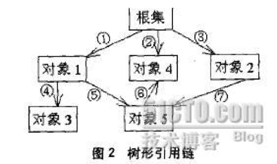

# <center>JVM</center>


## 1. JVM初始化内存分配
* JVM初始分配的内存由`-Xms`指定，默认是物理内存的1/64但小于1G。 
* JVM最大分配的内存由`-Xmx`指定，默认是物理内存的1/4但小于1G。

<br></br>

## 2. Happens-Before
&#12288;&#12288;如果一个操作执行的结果需要对另一个操作可见，那么这两个操作之间必须存在happens-before关系。这两个操作既可以在一个线程之内，也可以在不同线程之间。 

&#12288;&#12288;happens-before规则如下：
* 程序顺序规则：一个线程中的每个操作，happens- before 于该线程中的任意后续操作。
* 监视器锁规则：对一个监视器锁的解锁，happens- before 于随后对这个监视器锁的加锁。
* volatile变量规则：对一个volatile域的写，happens- before 于任意后续对这个volatile域的读。
* 传递性：如果A happens-before B，且B happens-before C，那么A happens-before C。

&#12288;&#12288;注意，两个操作之间有happens-before不意味着前一个操作要在后一个操作之前执行。happens-before仅要求前一个操作执行的结果对后一个操作可见，且前一个操作按顺序排在第二个操作之前（the first is visible to and ordered before the second）。

<br></br>

## 3. JVM的永久代中GC
&#12288;&#12288;GC不会发生在永久代，如果永久代满了或者是超过了临界值，会触发Full GC。

<br></br>

## 4. How can an object be unreferenced?
* By nulling a reference
```java
    Employee e=new Employee();  
    e=null;  
```

* By assigning a reference to another
```java
    Employee e1=new Employee();  
    Employee e2=new Employee();  
    e1=e2; //now the first object referred by e1 is available for garbage collection  
```

* By anonymous object
```java
new Employee();  
```

<br></br>

## 5. OOM
### 5.1 What will cause OOM?
Using a large number of `ArrayList` or `HashMap` with many elements each.

An `ArrayList` is implemented as a dynamic array. When a new element is inserted into a full `ArrayList`, a new array of 1.5 times the size of the original array is created, and the elements copied over. What this means is that you could be wasting up to 50% of the space in each `ArrayList` you use, unless you call its `trimToSize()` method. 

&#12288;&#12288;还有比如集合类中有对对象的引用，使用完后未清空，使得JVM不能回收；代码中存在死循环或循环产生过多重复的对象实体；内存中加载的数据量过于庞大，如一次从数据库取出过多数据。


### 5.2 How to solve OOM?
* java.lang.OutOfMemoryError: Java heap space
```
export JVM_ARGS="-Xms1024m -Xmx1024m"
```

* java.lang.OutOfMemoryError: PermGen space (usually caused by too many classloaders)
```
export JVM_ARGS="-XX:PermSize=64M -XX:MaxPermSize=256m"
```

* 在执行某个class文件时候，可使用`-Xmx256M aa.class`来设置运行aa.class时jvm所允许占用的最大内存为256M。

<br></br>

## 6. StackOverflow
&#12288;&#12288;为每个线程的栈分配的内存越大，反而越容易产生内存溢出异常。

&#12288;&#12288;因为OS分配给每个线程的内存是有限的，譬如32位Windows限制为2GB。剩余的内存为2G（操作系统内存）减去Xmx（堆最大容量），再减去MaxPermSize（最大方法区容量），程序计数器消耗的内存很小，可以忽略。剩下的内存就由虚拟机栈和本地方法栈“瓜分”了。每个线程分配到栈容量越大，可以建立的线程数自然越 少，建立线程时越容易把剩余的内存耗尽。

<br></br>

## 7. StrongReference, SoftReference, WeakReference & PhantomReference
### 7.1 StrongReference强引用
&#12288;&#12288;强引用是指在程序代码之中普遍存在的，比如：

```java
Object obj = new Object();
String str = "hello";
```

&#12288;&#12288;只要某个对象有强引用与之关联，JVM必定不会回收这个对象，即使在内存不足的情况下，JVM宁愿抛出OutOfMemory也不会回收这种对象。如果想中断强引用和某个对象的关联，可以显示地将引用赋值为`null`， 比如Vector类的clear方法：

```java
public synchronized E remove(int index) {
    modCount++;
    if (index >= elementCount)
        throw new ArrayIndexOutOfBoundsExpection(index);
    Object oldValue = elementData(index);
    int numMoved = elementCount - index - 1;
    if (numMoved > 0)
        System.arraycopy(elementData, index + 1, elementData, index, numMoved);
    elementData[--elementCount] = null; // let gc do its work

    return (E)oldValue;
}
```

### 7.2 SoftReference软引用
&#12288;&#12288;软引用是一些有用但并不是必需的对象，用`java.lang.ref.SoftReference`类来表示。对于软引用关联的对象，只有在内存不足时JVM才会回收。因此，可用来解决OOM，且很适合用来实现缓存：比如网页缓存、图片缓存等。

&#12288;&#12288;软引用可以和一个引用队列（ReferenceQueue）联合使用，如果软引用所引用的对象被JVM回收，这个软引用就会被加入到与之关联的引用队列中：

```java
import java.lang.ref.SoftReference;

public class Main {
    public static void main(String[] args) {
        SoftReference<String> ar = new SoftReference<String>(new String("hello"));
        System.out.println(sr.get());
    }
}
```


### 7.3 WeakReference弱引用
&#12288;&#12288;弱引用也是描述非必需对象。当GC时，无论内存是否充足，都会回收被弱引用关联的对象。用`java.lang.ref.WeakReference`类来表示：

```java
import java.lang.ref.WeakReference;

public class Main {
    public static void main(String[] args) {
        WeakReference<String> sr = new WeakReference<String>(new String("hello"));
        System.out.println(sr.get());
        System.gc(); 
        System.out.println(sr.get()); // null
    }
}
```

### 7.4 PhantomReference虚引用
&#12288;&#12288;虚引用不影响对象生命周期。用`java.lang.ref.PhantomReference`类表示。如果一个对象与虚引用关联，则跟没有引用与之关联一样，任何时候都可能被回收。

&#12288;&#12288;虚引用须和引用队列关联使用，当GC准备回收一个对象时，如果发现它还有虚引用，就会把这个虚引用加入到与之关联的引用队列中。程序可通过判断引用队列中是否已经加入了虚引用，来了解被引用的对象是否将要被垃圾回收。如果程序发现虚引用已被加入到引用队列，就可在所引用的对象的内存被回收之前采取行动。

```java
import java.lang.ref.PhantomReference;
import java.lang.ref.ReferenceQueue;

public class Main {
    public static void main(String[] args) {
        ReferenceQueue<String> queue = new ReferenceQueue<String>();
        PhantomReference<String> pr = new PhantomReference<String>(new String("hello"), queue);
        System.out.println(pr.get());
    }
}
```


### 7.5 WeakHashMap
`java.util.WeakHashMap` is a special version of the HashMap, which uses weak references as the key. Therefore, when a particular key is not in use anymore, and it is garbage collected, the corresponding entry in the WeakHashMap will disappear from the map. And the magic relies on ReferenceQueue mechanism to identify when a particular weak reference is to be garbage collected. This is useful when you want to build a cache based on weak references. 


### 7.6 各种引用对比


### 7.7 利用软引用和弱引用解决OOM
&#12288;&#12288;JVM的GC线程对软可达对象和其他对象区别对待：软可及对象的清理是由垃圾收集线程根据其特定算法按照内存需求决定的。即垃圾收集线程会在抛出OOM前回收软可及对象，而且虚拟机会尽可能优先回收长时间闲置不用的软可达对象，对那些刚刚构建的或刚刚使用过的软可达对象会被虚拟机尽可能保留。在回收这些对象之前，可以通过`MyObject anotherRef =(MyObject) aSoftRef.get()`
重新获得对该实例的强引用。而回收之后，调用`get()`方法就只能得到`null`。
        
&#12288;&#12288;假如需读取大量的本地图片，如果每次读取图片都从硬盘读取，会严重影响性能，如果全部加载到内存，又可能内存溢出，此时使用软引用可以解决这个问题。设计思路：用HashMap保存图片路径和相应图片对象关联的软引用之间的映射关系，内存不足时，JVM会回收缓存图片对象所占用的空间 。

```java
private Map<String, SoftReference<Bitmap>> imageCache = new HashMap<String, SoftReference<Bitmap>>();

public void addBitmapToCache(String path) {
    Bitmap bitmap = BitmapFactory.decodeFile(path); // StrongReference
    SoftReference<Bitmap> softBitmap = new SoftReference<Bitmap>(bitmap); // SoftReference
    imageCache.put(path, softBitmap); // cache it
}

public Bitmap getBitmapByPath(String path) {
    SoftReference<Bitmap> softBitmap = imageCache.get(path); // ger SoftReference object Bitmap from cache
    if (softBitmap == null)
        return null;
    Bitmap bitmap = softBitmap.get(); // get object Bitmap, if Bitmap is reclaimed, it will be null

    return bitmap;
}
```

### 7.8 对象可达性判断



&#12288;&#12288;很多时候，一个对象并不是从根集直接引用，而是一个对象被其他对象引用，甚至同时被几个对象所引用，从而构成一个以根集为顶的树形结构。由此带来了一个问题，那就是某个对象的可及性如何判断:
* **单条引用路径**：在这条路径中，**最弱**的一个引用决定对象的可及性。
* **多条引用路径**：几条路径中，**最强**的一条的引用决定对象的可及性。


### 7.9 ReferenceQueue
&#12288;&#12288;当软可及对象被回收之后，虽然这个SoftReference对象的`get()`方法返回`null`，但这个SoftReference对象已经不再具有存在的价值，需要一个适当的清除机制 。在`java.lang.ref`包里提供了ReferenceQueue。如果在创建SoftReference对象时，使用ReferenceQueue作为参数提供给SoftReference的构造方法，如:

```java
ReferenceQueue queue = new ReferenceQueue();
SoftReference ref = new SoftReference(aMyObject, queue);
```

&#12288;&#12288;当这个SoftReference所引用的aMyOhject被回收时，ref所强引用的SoftReference对象被列入ReferenceQueue。 

&#12288;&#12288;任何时候都可调用ReferenceQueue的`poll()`方法检查是否有它所关心的非强可及对象被回收。如果队列为空，将返回`null`，否则该方法返回队列中前面的一个Reference对象。利用这个方法，可以检查哪个SoftReference所软引用的对象已经被回收。于是可以把失去软引用的对象清除掉。


