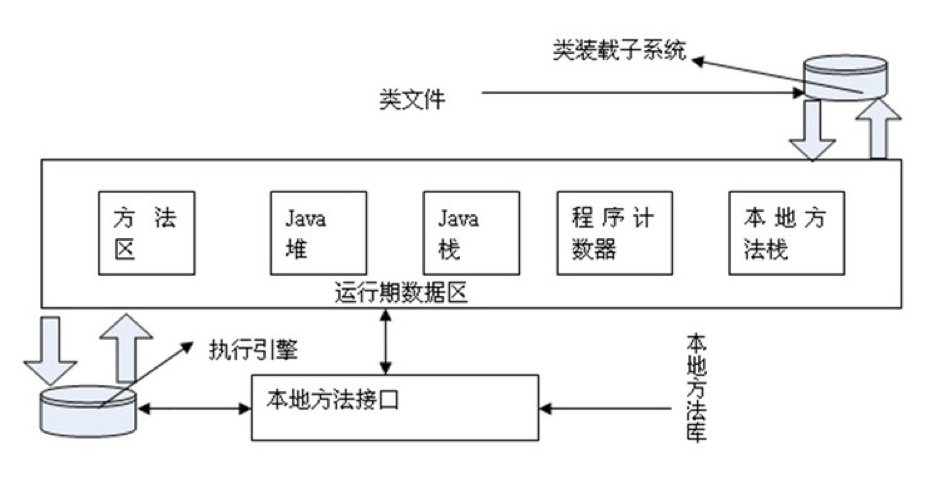

# 
Memory Management

&#12288;&#12288; 

## 1. 程序计数器 (Program Counter Register)
&#12288;&#12288;程序计数器是一块较小的内存空间，它是当前线程所执行的字节码的行号指示器。字节码解释器工作时通过改变这个计数器的值来选取下一条需要执行的字节码指令。分支、循环、跳转、异常处理、线程恢复等基础功能都需要依赖这个计数器来完成。

&#12288;&#12288;由于Java虚拟机的多线程是通过线程轮流切换并分配处理器执行时间的方式来实现的，在任何一个确定的时刻，一个处理器（对于多核处理器来说是一个内核）只会执行一条线程中的指令。因此，为了线程切换后能恢复到正确的执行位置，每条线程都需有一个独立的程序计数器，各条线程之间的计数器互不影响，独立存储，我们称这类内存区域为“线程私有”的内存。

&#12288;&#12288;如果线程正在执行的是一个Java方法，这个计数器记录的是正在执行的虚拟机字节码指令的地址；如果正在执行的是Natvie方法，这个计数器值则为Undefined。此内存区域是唯一一个在Java虚拟机规范中没有规定任何OutOfMemoryError情况的区域。

## 2. Java虚拟机栈 (Java Virtual Machine Stacks)

&#12288;&#12288; 

&#12288;&#12288;与程序计数器一样，Java虚拟机栈也是线程私有的，它的生命周期与线程相同。虚拟机栈描述的是Java方法执行的内存模型：每个方法被执行的时候都会同时创建一个栈帧(Stack Frame)用于存储局部变量表、操作栈、动态链接、方法出口等信息。每一个方法被调用直至执行完成的过程，就对应着一个栈帧在虚拟机栈中从入栈到出栈的过程。

&#12288;&#12288;存放了编译期可知的基本数据类型(boolean、byte、char、short、int, float、long、double)、对象引用(reference 类型，指向对象起始地址的引用指针)和returnAddress类型(指向了一条字节码指令的地址)。

&#12288;&#12288;其中64位长度的long和double类型的数据会占用2个局部变量空间(Slot)，其余的数据类型只占用1个。局部变量表所需的内存空间在编译期间完成分配，当进入一个方法时，这个方法需要在帧中分配多大的局部变量空间是完全确定的，在方法运行期间不会改变局部变量表的大小。

&#12288;&#12288;对这个区域规定了两种异常状况：StackOverflow和OutOfMemoryError。

A thread can only access its own thread stack. Local variables created by a thread are invisible to all other threads than the thread who created it, even if two threads are executing the exact same code.

## 3. 本地方法栈 (Native Method Stacks)

&#12288;&#12288;本地方法栈与虚拟机栈所发挥的作用是非常相似的，其区别不过是虚拟机栈为虚拟机执行Java 方法（也就是字节码）服务，而本地方法栈则为虚拟机使用到的Native方法服务。

&#12288;&#12288;与虚拟机栈一样，本地方法栈区域也会抛出StackOverflowError和OutOfMemoryError异常。

## 4. Java堆

&#12288;&#12288;Java虚拟机规范中的描述是：所有通过new创建的对象的内存都在堆中分配，其大小通过`-Xmx`和`-Xms`来控制。Java堆是GC的主要区域. 

&#12288;&#12288;Java堆可以处于物理上不连续的内存空间中，只要逻辑上是连续的即可。既可以实现成固定大小的，也可以是可扩展的。

The heap contains all objects created in your Java application, regardless of what thread created the object. This includes the object versions of the primitive types (e.g. Byte, Integer, Long etc.). It does not matter if an object was created and assigned to a local variable, or created as a member variable of another object, the object is still stored on the heap. 

Objects on the heap can be accessed by all threads that have a reference to the object. When a thread has access to an object, it can also get access to that object's member variables. If two threads call a method on the same object at the same time, they will both have access to the object's member variables, but each thread will have its own copy of the local variables. 

## 5. 方法区 (Method Area)

&#12288;&#12288;方法区与Java堆一样，是各个线程共享的内存区域，它用于存储已被虚拟机加载的类信息、常量、静态变量、即时编译器编译后的代码等数据。JVM用持久代(Permanet Generation)存放方法区，可通过`-XX:PermSize`和`-XX:MaxPermSize`指定最小值和最大值。
         
&#12288;&#12288;这个区域的限制非常宽松，除了和Java堆一样不需要连续的内存和可以选择固定大小或者可扩展外，还可以选择不实现垃圾收集。 这个区域的内存回收目标主要是针对常量池的回收和对类型的卸载。

## 6. 运行时常量池 (Runtime Constant Pool)

&#12288;&#12288;运行时常量池是方法区的一部分。Class 文件中除了有类的版本、字段、方法、接口等描述等信息外，还有一项信息是常量池(Constant PoolTable)，用于存放编译期生成的各种字面量和符号引用，这部分内容将在类加载后存放到方法区的运行时常量池中。

&#12288;&#12288;运行时常量池相对于Class文件常量池的另外一个重要特征是具备动态性，Java不要求常量只能在编译期产生，也就是并非预置入Class文件中常量池的内容才能进入方法区运行时常量池，运行期间也可能将新的常量放入池中，这种特性被利用得比较多的是String 类的intern()。

## 7. Where to store local variable, object & static class?

* A local variable may be of a primitive type, in which case it is totally kept on the thread stack. 

* A local variable may also be a reference to an object. In that case the reference (the local variable) is stored on the thread stack, but the object itself if stored on the heap.

* An object may contain methods and these methods may contain local variables. These local variables are also stored on the thread stack, even if the object the method belongs to is stored on the heap. 

* An object's member variables are stored on the heap along with the object itself. That is true both when the member variable is of a primitive type, and if it is a reference to an object. 

* Static class variables are also stored on the heap along with the class definition. 

## 8. Difference between Java Heap Space and Stack Memory
* Heap memory is used by all the parts of the application whereas stack memory is used only by one thread of execution.
* Whenever an object is created, it’s always stored in the Heap space and stack memory contains the reference to it. Stack memory only contains local primitive variables and reference variables to objects in heap space.
* Objects stored in the heap are globally accessible whereas stack memory can’t be accessed by other threads.
* Memory management in stack is done in LIFO manner whereas it’s more complex in Heap memory because it’s used globally. Heap memory is divided into Young-Generation, Old-Generation etc.
* Stack memory is short-lived whereas heap memory lives from the start till the end of application execution.
* We can use -Xms and -Xmx JVM option to define the startup size and maximum size of heap memory. We can use -Xss to define the stack memory size.
* When stack memory is full, Java runtime throws java.lang.StackOverFlowError whereas if heap memory is full, it throws java.lang.OutOfMemoryError: Java Heap Space error.
Stack memory size is very less when compared to Heap memory. Because of simplicity in memory allocation (LIFO), stack memory is very fast when compared to heap memory.

## 9. The Java Memory Model And The Hardware Memory Architecture

## 10. Visibility of Shared Objects

If two or more threads are sharing an object, without the proper use of either volatile declarations or synchronization, updates to the shared object made by one thread may not be visible to other threads. 

Imagine that the shared object is initially stored in main memory. A thread running on CPU one then reads the shared object into its CPU cache. There it makes a change to the shared object. As long as the CPU cache has not been flushed back to main memory, the changed version of the shared object is not visible to threads running on other CPUs. This way each thread may end up with its own copy of the shared object, each copy sitting in a different CPU cache. 

The following diagram illustrates the sketched situation. One thread running on the left CPU copies the shared object into its CPU cache, and changes its count variable to 2. This change is not visible to other threads running on the right CPU, because the update to count has not been flushed back to main memory yet. 

To solve this problem you can use Java's volatile keyword. 

## 10. Race Conditions

If two or more threads share an object, and more than one thread updates variables in that shared object, race conditions may occur. 

Imagine if thread A reads the variable count of a shared object into its CPU cache. Imagine too, that thread B does the same, but into a different CPU cache. Now thread A adds one to count, and thread B does the same. Now var1 has been incremented two times, once in each CPU cache. 

If these increments had been carried out sequentially, the variable count would be been incremented twice and had the original value + 2 written back to main memory. 

However, the two increments have been carried out concurrently without proper synchronization. Regardless of which of thread A and B that writes its updated version of count back to main memory, the updated value will only be 1 higher than the original value, despite the two increments. 

To solve this problem you can use a Java synchronized block. A synchronized block guarantees that only one thread can enter a given critical section of the code at any given time. Synchronized blocks also guarantee that all variables accessed inside the synchronized block will be read in from main memory, and when the thread exits the synchronized block, all updated variables will be flushed back to main memory again, regardless of whether the variable is declared volatile or not. 

