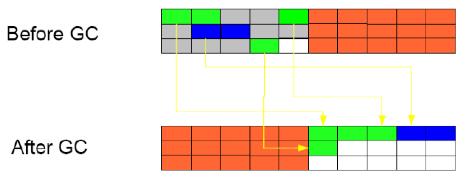
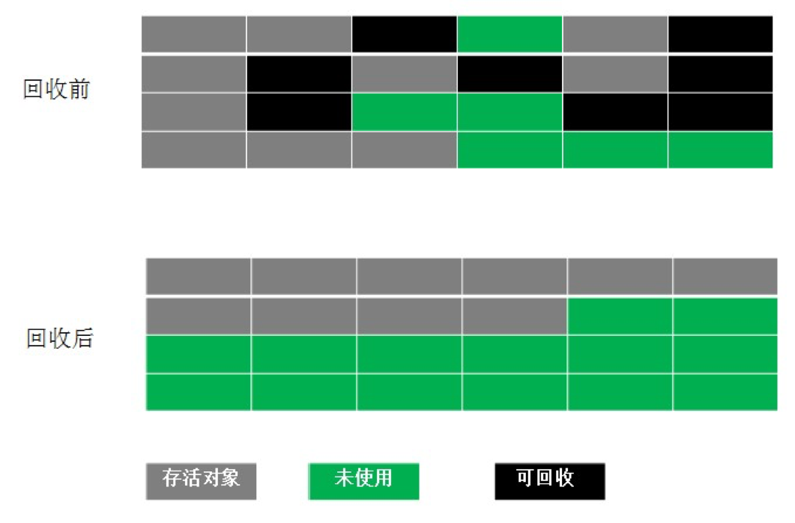
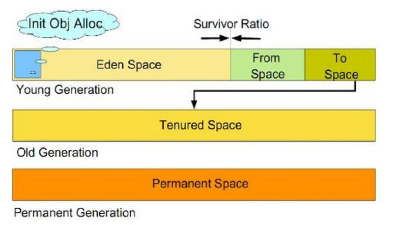

# 
Garbage Collector

  

| GC算法    |   优点     | 缺点              | 存活对象移动 | 内存碎片 | 适用场景 |
| :------: | :--------  | :--------------- | :--------: | :-----: | :----- |
| 引用计数  | 简单        | 不能解决循环引用    |     N      |   Y     |        |
| 标记-清除 | 无需额外空间  |  两次扫描，耗时严重 | N          | Y      | 旧生代   |
| 复制     | 没有标记和清除 | 需额外空间        | Y          | N      | 新生代   |
| 标记整理  | 无内存碎片   | 有移动对象的成本    | Y          | N      | 旧生代   |

  

## 标记-清除(Mark-Sweep)
----
步骤：
1. 标记：根据可达性分析对不可达对象进行标记
2. 清理：回收被标记的对象所占用的空间

优点：实现简单

缺点：
* 标记和清理的效率不高（因为垃圾对象比较少，大部分都不是垃圾）
* 产生大量内存碎片，导致后续需要为大对象分配空间时无法找到足够的空间而提前触发GC

适用场景：老年代。

 

  

## 复制(Copying)
-----
Copying算法为了解决Mark-Sweep算法缺陷。

步骤：
1. 将堆内分成两个相同空间。
2. 从根开始访问每一个关联的活跃对象，将空间A的活跃对象全部复制到空间B。
3. 一次性回收整个空间A。

优点：无内存碎片

缺点：
1. 耗时高。
2. 效率跟存活对象数目多少有关系。
3. 能够使用的内存缩减到原来的一半。

适用场景：新生代

 

  

## 标记-压缩(Mark-Compact)
----
在完成标记后，不是直接清理可回收对象，而将存活对象向一端移动，然后清理掉端边界以外的内存.

步骤：
1. 在标记好待回收对象后，将存活的对象移至一端。
2. 然后对剩余的部分进行回收。

优点：可解决内存碎片问题。

缺点：耗时高。

适用场景：基于Mark-Compact的GC多用于老年代

 

  

## 标记-整理-压缩(Mark-Sweep-Compact)
----
Mark-Sweep-Compact算法为了解决Copying算法缺陷，综合了上述两者做法和优点，先标记活跃对象，在完成标记之后，不直接清理可回收对象，而是将存活对象向一端移动，然后清理掉端边界以外的内存，将其合并成较大的内存块.

 

  

## 分代收集(Generational Collection)
----

 

 

 

### 新生代(Young)
新建对象用新生代分配内存，新生代进一步分为Eden和Survivor区，Survivor由FromSpace和ToSpace组成。

Eden空间不足时，把存活对象转移到Survivor。新生代存活时间短，因此基于Copying算法进行回收，在Eden的FromSpace或ToSpace之间copy。

> `-XX:NewRatio=`参数可设置Young与Old大小比例，`-XX:SurvivorRatio=`参数可设置Eden与Survivor比例。

新生代采用空闲指针方式控制GC触发。指针保持最后一个分配的对象在新生代区间的位置，当有新对象要分配内存时，用于检查空间是否足够，不够就触发GC(minor GC)。当连续分配对象时，对象会逐渐从Eden到Survivor。 

> 年轻代的痛：由于对年轻代的复制收集，须停止所有线程。只能靠多CPU，多线程并发来提高收集速度。所以，暂停时间的瓶颈就落在了年轻代的复制算法上。

 

 

### 年老代(Old)
`-XX:MaxTenuringThreshold=`设置熬过年轻代多少次GC后移入老人区，默认为0，熬过一次GC就转入。对象存活周期长的对象放在老年代：
* 存放新生代中经历多次GC仍然存活的对象；
* 新建的对象也可能直接在旧生代分配，取决于具体GC实现；
* GC频率降低，标记(mark)、清理(sweep)、压缩(compaction)算法的各种结合和优化。

Old常见对象为比如Http请求中的Session对象、线程、Socket连接，这类对象跟业务直接挂钩，因此生命周期比较长。

 

### 永久代(Permanent)
装载Class信息等基础数据，默认64M。如果是类很多的程序，需加大其设置`-XX:MaxPermSize=`，否则满了后会引起Major GC。Spring，Hibernate这类喜欢AOP动态生成类的框架需要更多的持久代内存。

 

### 对象提升到老年代
1.对象分配

 

  

2.填充到Eden区

 

  

3.将Eden区中存活的对象（引用对象）拷贝到其中一个存活区

 

  

4.年龄计数器：在Eden中存活的对象其年龄初始=1，从其他存活区存活下来年龄+1

 

  

5.增加年龄计数器，图中To存活区有三个对象来自于From存活区，一个对象来自Eden

 

  

6.对象提升，这里假设年龄阈值=8，发生GC时，From存活区中=8的对象提升到老年代，其他存活对象移动到To存活区

 

  

7.总结下对象提升的过程：对象在新生代分配，每当熬过一次YGC，对象的年龄计数器+1，当达到阈值时仍然存活，提升到老年代

 

  

8.总结下GC过程：对象在新生代分配并填充，当新生代满时发生YGC，当对象在存活区熬过一定年龄，提升到老年代

 

  

## GC Type
----
1. Serial GC (`-XX:+UseSerialGC`)

    **uses mark-sweep-compact approach for young and old generations gc** i.e Minor and Major GC. Serial GC is useful in client-machines such as our simple stand alone applications and machines with smaller CPU. It is good for small applications with low memory footprint.

2. Parallel GC (`-XX:+UseParallelGC`) 

    **Parallel GC is same as Serial GC except that is spawns N threads for young generation gc where N is the number of CPU cores in the system**. We can control the number of threads using `-XX:ParallelGCThreads = n`. Parallel Garbage Collector is also called throughput collector because it uses multiple CPUs to speed up the GC performance. Parallel GC uses single thread for Old Generation garbage collection.

3. Parallel Old GC (`-XX:+UseParallelOldGC`)

    **same as Parallel GC except that it uses multiple threads for both Young Generation and Old Generation garbage collection**.

4. Concurrent Mark Sweep (CMS) Collector (`-XX:+UseConcMarkSweepGC`)

    CMS Collector is also referred as concurrent low pause collector. **It does gc for Old generation. CMS collector tries to minimize the pauses due to gc by doing most of the gc work concurrently with the application threads. CMS collector on young generation uses the same algorithm as that of the parallel collector. This gc is suitable for responsive applications where we can’t afford longer pause times**. We can limit the number of threads in CMS collector using `-XX:ParallelCMSThreads = n`.

5. G1 Garbage Collector (`-XX:+UseG1GC`)

    The Garbage First or G1 garbage collector is **available from Java 7** and it’s long term goal is to **replace CMS collector**. The G1 collector is a parallel, concurrent, and incrementally compacting low-pause garbage collector. **G1 doesn’t work like other collectors and there is no concept of Young and Old generation space. It divides the heap space into multiple equal-sized heap regions. When gc is invoked, it first collects the region with lesser live data, hence “Garbage First”**.
        
  

## 确定垃圾
----

GC roots:
    1. **Stack Local - Java方法的local变量或参数**

        Local variables are kept alive by the stack of a thread. This is not a real object virtual reference and thus is not visible. For all intents and purposes, local variables are GC roots.

    2. **Thread - 活着的线程**

        Active Java threads are always considered live objects and are therefore GC roots. This is especially important for thread local variables.

    3. **Static variables** 

        Referenced by their classes. This fact makes them de facto GC roots. Classes themselves can be garbage-collected, which would remove all referenced static variables. 

    4. **JNI Local - JNI方法的local变量或参数**

    5. **Monitor Used - 用于同步的监控对象**

    7. **Class - 由系统类加载器加载的对象**

JVM判定无用的类的条件：
1. 该类的所有实例已经被回收，java堆中不存在该类的任何示例
2. 加载该类的ClassLoader已经被回收
3. 该类对应的java.lang.Class对象没有在任何地方被引用

  

## Improve Performance
----
1. **不要显式调用`System.gc()`**

2. **减少临时对象的使用**

3. **对象不用时显式置为`null`**

4. **使用StringBuffer，而不用String来累加字符串**

5. **能用基本类型如int，就不用Integer对象**

    基本类型变量占用的内存资源比相应对象少得多，如果没有必要，最好使用基本变量。

6. **少用静态对象变量**

    静态变量属于全局变量，不会被GC回收，它们会一直占用内存。

7. **分散对象创建或删除的时间**

  

## 串行、并行、并发GC
----
串行和并行指的是垃圾收集器工作时暂停应用程序（Stop the World），使用单核CPU（串行）还是多核CPU（并行）。

* 串行（Serial）：使用单核CPU串行地进行垃圾收集。
* 并行（Parallel）：使用多CPU并行地进行垃圾收集，并行是GC线程有多个，但在运行GC线程时，用户线程是阻塞的。
* 并发（Concurrent）：垃圾收集时不会暂停应用程序线程，大部分阶段用户线程和GC线程都在运行。
      
| 概念   |  STW | 单线程／多线程 | 
| :---: | :----: | :--------: | 
| 串行  | Y | GC单线程 | 
| 并行 | Y |  GC多线程 |
| 并发 | N | GC和用户线程是多线程 |

  

## 增量式GC和普通GC
----
GC由一个或一组进程来实现的，它本身也和用户程序一样占用heap空间，运行时也占用CPU。当GC运行时，应用程序停止运行。增量式GC是指把一个长时间的中断，划分为很多个小的中断，减少GC对用户程序的影响。虽然增量式GC整体性能上不如普通GC的效率高，但是能够减少程序的最长停顿时间。

增量式GC采用TrainGC算法，基本想法是将堆中的所有对象按照创建和使用情况进行分组（分层），将使用频繁高和具有相关性的对象放在一队中，随着程序的运行，不断对组进行调整。当GC运行时，它总是先回收最老的（最近很少访问的）的对象，如果整组都为可回收对象，GC将整组回收。这样，每次GC运行只回收一定比例的不可达对象，保证程序的顺畅运行。
