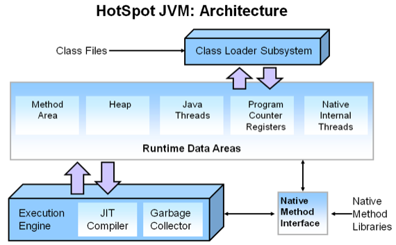
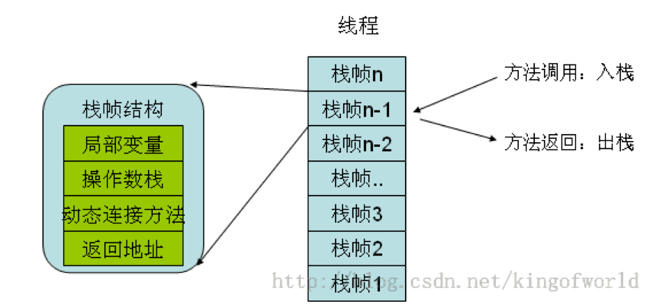

# 
Memory Model

  

  

  

## 程序计数器 Program Counter Register
----
程序计数器是一块较小的内存空间，是当前线程执行的字节码的行号指示器。字节码解释器工作时通过改变计数器值选取下一条需要执行的字节码指令。

JVM多线程通过线程轮流切换并分配处理器执行时间方式实现的。在任一时刻，一个处理器（对于多核处理器是一个内核）只会执行一条线程中指令。因此，为线程切换后能恢复到正确执行位置，每条线程都需有一个独立的程序计数器，**称这类内存区域为线程私有内存**。

> 此内存区域是唯一一个在JVM规范中没规定任何OutOfMemoryError情况的区域。

  

## Stack
----
### 虚拟机栈 Virtual Machine Stacks

 

 

**与程序计数器一样，虚拟机栈也是线程私有的，它的生命周期与线程相同。**

存放了编译期可知的基本数据类型（boolean、byte、char、short、int, float、long、double）、对象引用（reference类型）和returnAddress类型（指向字节码指令地址）。其中64位长度的long和double类型数据占用2个局部变量空间（Slot）。局部变量表所需的内存空间在编译期间完成分配。

对这个区域规定了两种异常状况：StackOverflowError和OutOfMemoryError。

 

### 本地方法栈 Native Method Stacks
**本地方法栈与虚拟机栈作用相似，区别是虚拟机栈为虚拟机执行Java方法服务，而本地方法栈为Native方法服务。**

与虚拟机栈一样，本地方法栈区域也会抛出StackOverflowError和OutOfMemoryError异常。

  

## 堆
----
所有通过new创建的对象的内存都在堆中分配，其大小通过`-Xmx`和`-Xms`控制。堆可处于物理上不连续的内存空间中，只要逻辑上连续的即可。既可实现成固定大小的，也可以是可扩展的。 

  

## 方法区 Method Area
----
**方法区与堆一样，是各线程共享内存区域，它用于存储已被虚拟机加载的类信息、常量、静态变量、即时编译器编译后的代码等数据。**JVM用持久代（Permanet Generation）存放方法区，通过`-XX:PermSize`和`-XX:MaxPermSize`指定最小值和最大值。
         
这个区域内存GC主要是常量池和对类型的卸载。

 

### 运行时常量池 Runtime Constant Pool
**运行时常量池是方法区一部分，存放编译期生成的各种字面量和符号引用，这部分在类加载后存放到方法区的运行时常量池中**。

运行时常量池相对于Class文件常量池另外一个区别是动态性。Java不要求常量只能在编译期产生，并非预置入Class文件中常量池的内容才能进入方法区运行时常量池，运行期间也可能将新的常量放入池中。这特性被利用得较多的是String类`intern()`。
