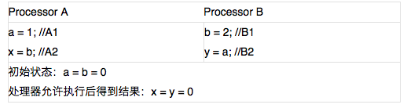

# <center>JVM Theory</center>

<br></br>


## 重排序
----
从Java源码到最终实际执行的指令序列，会经历下面三种重排序：
1. 编译器优化重排序。编译器在不改变单线程程序语义前提下，重新安排语句的执行顺序。
2. 指令级并行重排序。现代处理器采用了指令级并行技术（Instruction-Level Parallelism）将多条指令重叠执行。如果不存在数据依赖性，处理器可以改变语句对应机器指令的执行顺序。
3. 内存系统的排序。由于处理器使用缓存和读写缓冲区，这使加载和存储操作看上去可能是在乱序执行。

<p align="center">
  
</p>

1属于编译器重排序，2和3属于处理器重排序。JMM编译器重排序规则会禁止特定类型的编译器重排序。JMM的处理器重排序规则会要求Java编译器在生成指令序列时，插入特定类型的内存屏障（memory barriers，intel称之为memory fence）指令，通过内存屏障指令来禁止特定类型的处理器重排序。

<br>


### 处理器重排序与内存屏障指令

<p align="center">
  
</p>

<center><i>内存的读/写操作的执行示例</i></center>

<br>

假设处理器A和B按程序顺序并行执行，最终却可能得到x = y = 0。原因：

<p align="center">
  
</p>

处理器允许的重排序类型的列表：

| Type    |  Load-Load | Load-Store | Store-Store | Store-Load | 数据依赖 |
| :-----: | :-------:  | :--------: | :---------: | :------:   | :----:  |
| x86     | N          |  N         |   N         |  Y         |  N      |
| ia64    |   Y        |  Y         |    Y        |  Y         |   N     |
| PowerPC |    Y       |  Y         |    Y        |     Y      |   N     |

<br>

内存屏障指令分为下列四类：

| 屏障类型    |             指令示例        | 说明 | 
| :-------:  | :------------------------: | :-------- | 
| LoadLoad   | Load1; LoadLoad; Load2     | 确保Load1数据的装载，之前于Load2及所有后续装载指令的装载。  |   
| StoreStore | Store1; StoreStore; Store2 | 确保Store1数据对其他处理器可见（刷新到内存），之前于Store2及所有后续存储指令的存储。 |    
| LoadStore  |  Load1; LoadStore; Store2  |  确保Load1数据装载，之前于Store2及所有后续的存储指令刷新到内存。 |   
| StoreLoad  |  Store1; StoreLoad; Load2  |  确保Store1数据对其他处理器变得可见（刷新到内存），之前于Load2及所有后续装载指令的装载。 |   

> 注意，数据依赖性仅针对单处理器中执行的指令序列和单线程中执行的操作，不同处理器之间和不同线程之间的数据依赖性不被编译器和处理器考虑。

<br>


### 重排序对多线程影响

``` java
class ReorderExample {
	int a = 0;
	boolean flag = false;

	public void writer() {
    	a = 1;                   // 1
    	flag = true;             // 2
	}

	public void reader() {
    	if (flag)                // 3
        	int i =  a * a;      // 4
	}
}
```

`flag`标识`a`是否已被写入。假设有两个线程A和B，A先执行`writer()`方法，随后B线程执行`reader()`方法。线程B在执行操作4时，能否看到线程A在操作1对共享变量`a`的写入？

不一定。

由于操作1和操作2没有数据依赖关系，编译器和处理器可对这两个操作重排序；同样，操作3和操作4没有数据依赖关系，编译器和处理器也可以对这两个操作重排序。

操作1和操作2重排序时，会产生什么效果？

<p align="center">
  
</p>

<center><i>红色虚线表示错误的读操作</i></center>

<br>

操作1和2做了重排序。线程A先写标记变量`flag`，随后线程B读这个变量。由于条件判断为真，线程B将读取变量`a`。此时，变量`a`还没有被线程A写入，在这里多线程程序的语义被重排序破坏了。

下面是操作3和操作4重排序后，程序的执行时序图：

<p align="center">
  
</p>

<br>

操作3和4存在控制依赖关系。当代码中存在控制依赖性时，会影响指令序列执行的并行度。为此，编译器和处理器会采用猜测（Speculation）执行来克服控制相关性对并行度的影响。执行线程B的处理器可提前读取并计算`a * a`，然后把结果临时存到名为重排序缓冲（reorder buffer ROB）的硬件缓存中。当接下来操作3的条件判断为真时，就把计算结果写入变量`i`中。猜测执行实质上对操作3和4做了重排序。重排序在这里破坏了多线程程序的语义。

<br></br>


## 数据竞争与顺序一致性保证
----
Java内存模型规范对数据竞争的定义如下：
* 在一个线程中写一个变量，
* 在另一个线程读同一个变量，
* 而且写和读没有通过同步来排序。

JMM对正确同步的多线程程序的内存一致性做了如下保证：如果程序是正确同步的，程序的执行将具有顺序一致性（sequentially consistent），即程序的执行结果与该程序在顺序一致性内存模型中的执行结果相同。

<br>


### 顺序一致性内存模型
顺序一致性内存模型有两大特性：
1. 一个线程中所有操作必须按照程序顺序执行。
2. 不管程序是否同步，所有线程都只能看到一个单一的操作顺序。在顺序一致性内存模型中，每个操作都必须原子执行且立刻对所有线程可见。

假设线程A和B并发执行。A有三个操作，顺序是A1->A2->A3。B顺序是B1->B2->B3。这两个线程使用监视器同步，A的三个操作执行后释放监视器，随后B获取监视器。在顺序一致性模型中的执行如下图所示：

<p align="center">
  
</p>

假设没有做同步，下面是未同步程序在顺序一致性模型中的执行：

<p align="center">
  
</p>

未同步程序在顺序一致性模型中虽然整体执行顺序是无序的，但所有线程都只能看到一个一致的整体执行顺序。A和B看到的执行顺序都是B1->A1->A2->B2->A3->B3。之所以能得到这个保证是因为顺序一致性内存模型中的每个操作必须立即对任意线程可见。

但在JMM中就没有这个保证。未同步程序在JMM中不但整体的执行顺序是无序的，而且所有线程看到的操作执行顺序也可能不一致。比如，在当前线程把写过的数据缓存在本地内存中，且还没有刷新到主内存之前，这个写操作仅对当前线程可见。在这种情况下，当前线程和其它线程看到的操作执行顺序将不一致。

<br>


### 同步程序的执行特性

``` java
class SynchronizedExample {
	int a = 0;
	boolean flag = false;

	public synchronized void writer() {
    	a = 1;
    	flag = true;
	}

	public synchronized void reader() {
    	if (flag) 
        	int i = a;
	}
}
```

该程序在两个内存模型中的执行时序对比图：

<p align="center">
  
</p>

在JMM中，临界区内代码可重排序（JMM不允许临界区内代码逸出到临界区之外）。JMM在退出监视器和进入监视器这两个时间点做一些处理，使线程在这两个时间点具有与顺序一致性模型相同的内存视图。虽然A在临界区内做了重排序，但由于监视器互斥执行的特性，B无法观察到A在临界区内的重排序。

<br>


### 未同步程序执行特性
对未同步多线程程序，JMM只提供最小安全性：线程执行时读取的值，要么是之前某个线程写入的值，要么是默认值。为实现最小安全性，JVM在堆上分配对象时，先会清零内存空间，然后在上面分配对象。因此，在以清零的内存空间（pre-zeroed memory）分配对象时，域的默认初始化已经完成了。

未同步程序在两个模型中执行有下面几个差异：
1. 顺序一致性模型保证单线程内的操作会按程序的顺序执行，而JMM不保证。
2. 顺序一致性模型保证所有线程只能看到一致的执行顺序，而JMM不保证。
3. JMM不保证对64位的`long`/`double`型变量的读写操作具有原子性，而顺序一致性模型保证对所有的内存读写操作都具有原子性。

第3个差异与处理器总线工作机制相关。每次处理器和内存间的数据传递是通过一系列步骤来完成的，称为总线事务，包括读事务和写事务。读事务从内存传送数据到处理器，写事务从处理器传送数据到内存。总线会同步试图并发使用总线的事务。在处理器执行总线事务期间，总线会禁止其它处理器和I/O设备执行内存读/写。

一些32位处理器上，要对64位数据的读写操作具有原子性，会有较大开销。为了照顾这种处理器，Java不强求JVM对64位的`long`/`double`型变量读写具有原子性。当JVM在这种处理器上运行时，会把一个64位`long`/`double`型变量的读写操作拆分为两个32位的读写操作来执行。

<br></br>


## Conclusion
----
### 内存屏障
由于常见的处理器内存模型比JMM要弱，Java编译器在生成字节码时，会在执行指令序列的适当位置插入内存屏障来限制处理器的重排序。同时，由于各种处理器内存模型的强弱不同，为在不同处理器平台向程序员展示一致的内存模型，JMM在不同的处理器中需插入的内存屏障的数量和种类也不相同。

<p align="center">
  
</p>

<center><i>JMM在不同处理器内存模型中需要插入的内存屏障</i></center>

<br>

JMM是一个语言级的内存模型，处理器内存模型是硬件级的内存模型，顺序一致性内存模型是一个理论参考模型。

<p align="center">
  
</p>

<center><i>语言内存模型，处理器内存模型和顺序一致性内存模型的强弱对比示意图</i></center>

<br>


### JMM设计
在设计JMM时，需考虑两个因素：
1. 程序员对内存模型的使用。程序员希望内存模型易于理解，易于编程。程序员希望基于一个强内存模型来编写代码。
2. 编译器和处理器对内存模型的实现。编译器和处理器希望内存模型对它们的束缚越少越好，这样它们就可以做尽可能多的优化来提高性能。编译器和处理器希望实现一个弱内存模型。

下面看看如何实现这一目标。

``` java
double pi  = 3.14;    // A
double r   = 1.0;     // B
double area = pi * r * r; // C
```

happens-before关系：
1. A happens-before B
2. B happens-before C
3. A happens-before C

由于A happens-before B，要求A操作结果对B可见，且A操作顺序在B前。但从程序语义角度来说，对A和B做重排序不会改变执行结果。因此，JMM把happens-before要求禁止的重排序分为两类并采取不同策略：
1. 会改变程序执行结果的重排序，JMM要求编译器和处理器须禁止这种重排序。
2. 不会改变程序执行结果的重排序，JMM对编译器和处理器不作要求（JMM允许这种重排序）。

<p align="center">
  
</p>

<center><i>JMM设计示意图</i></center>

<br>


### 内存可见性保证
Java程序的内存可见性保证分为三类：
1. 单线程程序。

	单线程程序不会出现内存可见性问题。

2. 正确同步的多线程程序。

	正确同步的多线程程序执行具有顺序一致性，即程序执行结果与该程序在顺序一致性内存模型中执行结果相同。JMM通过限制编译器和处理器重排序来为程序员提供内存可见性保证。

3. 未同步或未正确同步的多线程程序。

	JMM提供最小安全性保障，即线程执行时读取到的值，要么是之前某个线程写入的值，要么是默认值。

<p align="center">
  
</p>

<center><i>三类程序在JMM中与在顺序一致性内存模型中的执行结果</i></center>

<br></br>
