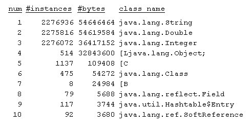
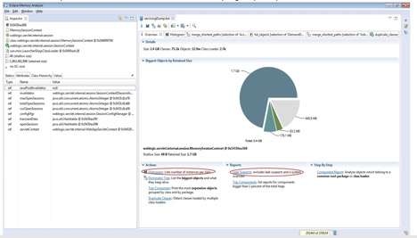

# <center>Troubleshooting Memory Issues</center>

<br></br>


## OutOfMemoryError: Java Heap Space
----
The most common cause of OOM is that the specified maximum Java heap size is not sufficient to accommodate the full set of live objects. One simple way to check it is to inspect the GC logs.

```
688995.775: [Full GC [PSYoungGen: 46400K->0K(471552K)] [ParOldGen: 1002121K->304673K(1036288K)] 1048521K->304673K(1507840K) [PSPermGen: 253230K->253230K(1048576K)], 0.3402350 secs] [Times: user=1.48 sys=0.00, real=0.34 secs]
```

We can see from the above log entry that after the Full GC, the heap occupancy drops from 1GB (1048521K) to 305MB (304673K), which means that 1.5GB (1507840K) allocated to the heap is large enough to contain the live data set.

Now, let's take a look at the following GC activity:
```
20.343: [Full GC (Ergonomics) [PSYoungGen: 12799K->12799K(14848K)] [ParOldGen: 33905K->33905K(34304K)] 46705K- >46705K(49152K), [Metaspace: 2921K->2921K(1056768K)], 0.4595734 secs] [Times: user=1.17 sys=0.00, real=0.46 secs]
...... <snip> several Full GCs </snip> ......
22.640: [Full GC (Ergonomics) [PSYoungGen: 12799K->12799K(14848K)] [ParOldGen: 33911K->33911K(34304K)] 46711K- >46711K(49152K), [Metaspace: 2921K->2921K(1056768K)], 0.4648764 secs] [Times: user=1.11 sys=0.00, real=0.46 secs]
23.108: [Full GC (Ergonomics) [PSYoungGen: 12799K->12799K(14848K)] [ParOldGen: 33913K->33913K(34304K)] 46713K- >46713K(49152K), [Metaspace: 2921K->2921 K(1056768K)], 0.4380009 secs] [Times: user=1.05 sys=0.00, real=0.44 secs]
23.550: [Full GC (Ergonomics) [PSYoungGen: 12799K->12799K(14848K)] [ParOldGen: 33914K->33914K(34304K)] 46714K- >46714K(49152K), [Metaspace: 2921K->2921 K(1056768K)], 0.4767477 secs] [Times: user=1.15 sys=0.00, real=0.48 secs]
24.029: [Full GC (Ergonomics) [PSYoungGen: 12799K->12799K(14848K)] [ParOldGen: 33915K->33915K(34304K)] 46715K- >46715K(49152K), [Metaspace: 2921K->2921 K(1056768K)], 0.4191135 secs] [Times: user=1.12 sys=0.00, real=0.42 secs] Exception in thread "main" java.lang.OutOfMemoryError: GC overhead limit exceeded at oom.main(oom.java:15)
```

From the frequency of the “Full GC” messages in the dump, there are several back-to-back Full GCs attempting to reclaim space in the Java heap, but the heap is completely full and the GCs are not able to free up any space. These frequent Full GCs negatively impact application performance. Increasing heap size will help avoid these full GCs and circumvent the OutOfMemoryError. The Java heap size can be increased using `-Xmx` JVM option:

```
java –Xmx1024m –Xms1024m Test
```

The OutOfMemoryError can also be an indication of a memory leak in the application. Memory leaks are often very hard to detect, especially slow memory leaks. As we know, a memory leak occurs when an application unintentionally holds references to objects in the heap, preventing them from being garbage collected. These unintentionally held objects can grow in the heap over time, eventually filling up the entire Java heap space, causing frequent garbage collections and ultimately the program termination with OutOfMemoryError.

Please note that it is always a good idea to enable GC logging, even in production environments. The following options can be used to turn on the GC logging:

```
-XX:+PrintGCDetails
-XX:+PrintGCTimeStamps
-XX:+PrintGCDateStamps
-Xloggc:<gc log file>
```

The first step in detecting memory leaks is to monitor the live-set of the application. The live-set is the amount of Java heap being used after a full GC. If the live-set is increasing over time even after the application has reached a stable state and is under a stable load then that could indicate a memory leak. 

<br></br>


## Java heap: Collection of Diagnostic Data
----
### Heap Dumps
Heap dumps can be collected using jcmd, jmap, JConsole and the HeapDumpOnOutOfMemoryError JVM option as shown below.

```
jcmd <process id/main class> GC.heap_dump filename=heapdump.dmp
jmap -dump:format=b,file=snapshot.jmap pid
JConsole utility, using Mbean HotSpotDiagnostic
-XX:+HeapDumpOnOutOfMemoryError
java -XX:+PrintGCDetails -XX:+PrintGCTimeStamps -Xmx20m -XX:+HeapDumpOnOutOfMemoryError oom 
0.402: [GC (Allocation Failure) [PSYoungGen: 5564K->489K(6144K)] 5564K->3944K(19968K), 0.0196154 secs] [Times: user=0.05 sys=0.00, real=0.02 secs] 
0.435: [GC (Allocation Failure) [PSYoungGen: 6000K->496K(6144K)] 9456K->8729K(19968K), 0.0257773 secs] [Times: user=0.05 sys=0.00, real=0.03 secs] 
0.469: [GC (Allocation Failure) [PSYoungGen: 5760K->512K(6144K)] 13994K->13965K(19968K), 0.0282133 secs] [Times: user=0.05 sys=0.00, real=0.03 secs] 
0.499: [Full GC (Ergonomics) [PSYoungGen: 512K->0K(6144K)] [ParOldGen: 13453K->12173K(13824K)] 13965K->12173K(19968K), [Metaspace: 2922K->2922K(1056768K)], 0.6941054 secs] [Times: user=1.45 sys=0.00, real=0.69 secs] 1.205: [Full GC (Ergonomics) [PSYoungGen: 5632K->2559K(6144K)] [ParOldGen: 12173K->13369K(13824K)] 17805K->15929K(19968K), [Metaspace: 2922K->2922K(1056768K)], 0.3933345 secs] [Times: user=0.69 sys=0.00, real=0.39 secs] 1.606: [Full GC (Ergonomics) [PSYoungGen: 4773K->4743K(6144K)] [ParOldGen: 13369K->13369K(13824K)] 18143K->18113K(19968K), [Metaspace: 2922K->2922K(1056768K)], 0.3009828 secs] [Times: user=0.72 sys=0.00, real=0.30 secs] 1.911: [Full GC (Allocation Failure) [PSYoungGen: 4743K->4743K(6144K)] [ParOldGen: 13369K->13357K(13824K)] 18113K->18101K(19968K), [Metaspace: 2922K->2922K(1056768K)], 0.6486744 secs] [Times: user=1.43 sys=0.00, real=0.65 secs] 
java.lang.OutOfMemoryError: Java heap space 
Dumping heap to java_pid26504.hprof ... 
Heap dump file created [30451751 bytes in 0.510 secs] Exception in thread "main" java.lang.OutOfMemoryError: Java heap space
 at java.util.Arrays.copyOf(Arrays.java:3210)
 at java.util.Arrays.copyOf(Arrays.java:3181)
 at java.util.ArrayList.grow(ArrayList.java:261)
 at java.util.ArrayList.ensureExplicitCapacity(ArrayList.java:235)
 at java.util.ArrayList.ensureCapacityInternal(ArrayList.java:227)
 at java.util.ArrayList.add(ArrayList.java:458)
 at oom.main(oom.java:14)
```

Please note that the parallel garbage collector can continuously attempt to free up room on the heap by invoking frequent back-to-back Full GCs, even when the gains of that effort are small and the heap is almost full. This impacts the performance of the application and may delay the re-bouncing of the system. This situation can be avoided by tuning the values for `-XX:GCTimeLimit` and `-XX:GCHeapFreeLimit`.

GCTimeLimit sets an upper limit on the amount of time that GCs can spend in percent of the total time. Its default value is 98%. 

GCHeapFreeLimit sets a lower limit on the amount of space that should be free after the garbage collections, represented as percent of the maximum heap. It’s default value is 2%. Increasing this value means that more heap space should get reclaimed by the GCs. 

An OutOfMemoryError is thrown after a Full GC if the previous 5 consecutive GCs (could be minor or full) were not able to keep the GC cost below GCTimeLimit and were not able to free up GCHeapFreeLimit space.

<br>


### Heap Histograms
Heap histograms can give us a quick view of the objects present in our heap, and comparing these histograms can help us find the top growers in our Java heap.

```
-XX:+PrintClassHistogram and Control+Break
jcmd <process id/main class> GC.class_histogram filename=Myheaphistogram
jmap -histo pid
jmap -histo <java> core_file
```

Sample output below shows that the String, Double, Integer and Object[] instances are occupying the most space in the Java heap, and are growing in number over time, indicating that these could potentially be causing a memory leak:

<p align="center">
  
</p>

<p align="center">
  
</p>

<br></br>


## Java Heap: Analysis of Diagnostic Data
----
### Heap Dump Analysis
Heap dumps can be analyzed using the following tools:

* Eclipse MAT - (Memory Analyzer Tool) -  a community developed tool for analyzing heap dumps. Some of the amazing features that it offers are:

    * Leak Suspects: it can inspect the heap dump for leak suspects reporting the objects that are suspiciously retaining large amount of heap
    * Histograms: lists the number of objects per class, and shallow as well retained heap held by those objects. The objects in the histogram can be easily sorted or filtered using regular expressions. That helps in zooming in and concentrating on the objects that we suspect could be leaking. It also has the capability to compare histograms from two heap dumps, and can show the difference in the number of instances for each class. This helps in finding the top growers in the Java heap which can be inspected further to determine the roots holding on those objects in the heap.
    * Unreachable objects: an amazing capability of MAT is that it allows to include or exclude the unreachable/dead objects in its working set of objects. If we don't want to look at the objects that are unreachable and eligible for collection in the next GC cycle, and are interested only in the reachable objects then this feature comes in very handy.
    * Duplicate Classes: shows duplicate classes loaded by multiple classloaders.
    * Path to GC roots: can show the reference chains to the GC roots (objects kept alive by the JVM itself) responsible for keeping the objects in the heap
    * OQL: we can use Object Query Language to explore the objects in the heap dumps. Its enriched OQL facilitates writing sophisticated queries that help dig deep into the heap dumps.

* Java VisualVM -  all-in-one tool for monitoring, profiling and troubleshooting Java applications. It is available as a JDK tool as well as can be downloaded from GitHub. One of the features it offers is the heap dump analysis. It has the capability to create heap dumps of the application being monitored, and can also load and parse them. 

* jhat command line tool (in jdk/bin folder.) provides heap dump analysis by browsing objects in the heap dump using any web browser. By default the web server is started at port 7000. jhat supports a wide range of pre-designed queries and Object Query Language(OQL) to explore the objects in the heap dumps.

* JOverflow plugin for Java Mission Control -  experimental plugin that enables Java Mission Control to perform simple heap dump analysis and reporting where the memory might be getting wasted.

<p align="center">
  
</p>

<center><i>Eclipse MAT</i></center>

<br>

MAT is enriched with advanced features, including the Histograms and the ability to compare them with the other histograms. This gives a clear picture as to what is growing in the memory and is retaining the maximum space in the Java heap. The ‘Merge Shortest Paths to GC Roots’ helps in finding the objects-trail responsible for retaining unintentionally held objects. 

For example, in the following reference-chain, ThreadLocalDateFormat object is held in the heap by the ‘value’ field of ThreadLocalMap$Entry object. Until the ThreadLocalMap$Entry is removed from the ThreadLocalMap, ThreadLocalDateFormat won’t get collected.
```
weblogic.work.ExecuteThread @ 0x6996963a8 [ACTIVE] ExecuteThread: '203' for queue: 'weblogic.kernel.Default (self-tuning)' Busy Monitor, Thread| 1 | 176 | 40 | 10,536
'- threadLocals java.lang.ThreadLocal$ThreadLocalMap @ 0x69c2b5fe0 | 1 | 24 | 40 | 7,560
'- table java.lang.ThreadLocal$ThreadLocalMap$Entry[256] @ 0x6a0de2e40 | 1 | 1,040 | 40 | 7,536
'- [116] java.lang.ThreadLocal$ThreadLocalMap$Entry @ 0x69c2ba050 | 1 | 32 | 40 | 1,088
'- value weblogic.utils.string.ThreadLocalDateFormat @ 0x69c23c418 | 1 | 40 | 40 | 1,056
```

<br>


### OutOfMemoryError due to Finalization
Objects with a finalizer may delay the reclamation of the space occupied by them. The finalizer thread needs to invoke the `finalize()` method of the instances before those instances can be reclaimed and their heap space freed. If the finalizer thread does not keep up with the rate at which the objects become eligible for finalization, the JVM might fail with an OutOfMemoryError even though the objects piled up in the finalizer’s queue were eligible for collection. 

We can use 'Heap Dumps' to monitor the number of objects that are pending finalization:
```
Date taken: Fri Jan 06 14:48:54 PST 2017
	File: D:\tests\java_pid19908.hprof
	File size: 11.3 MB
 
	Total bytes: 10,359,516
	Total classes: 466
	Total instances: 105,182
	Classloaders: 2
	GC roots: 419
	Number of objects pending for finalization: 2
```

<br>


### OutOfMemoryError: PermGen Space
As we know, PermGen has been removed as of Java 8, so If you are running on Java 8 or beyond, feel free to skip this section.

Up until Java 7, PermGen (short for “permanent generation”) was used to store class definitions and their metadata. Unexpected growth of the PermGen or an OutOfMemoryError in this memory space meant that either the classes are not getting unloaded as expected, or the specified PermGen size is too small to fit all the loaded classes and their metadata.

To ensure that the PermGen is sized appropriately per the application requirements, we should monitor its usage and configure it accordingly using the following JVM options:
```
–XX:PermSize=n –XX:MaxPermSize=m
```

<br>


### OutOfMemoryError: Metaspace
Example of an OutOfMemoryError for the MetaSpace:
```
java.lang.OutOfMemoryError: Metaspace
```

Since Java 8, class metadata is stored in the Metaspace. Metaspace is not part of the Java heap and is allocated out of the native memory. So it is unlimited and is limited only by the amount of native memory available on the machine. However, Metaspace size can be limited by using the MaxMetaspaceSize option.

We can encounter an OutOfMemoryError for the Metaspace if and when its usage reaches the maximum limit specified with MaxMetaspaceSize. As with the other spaces, this could be due to the inadequate sizing of the Metaspace or there is a classloader/classes leak. 

<br>


### OutOfMemoryError: Compressed class space
If UseCompressedClassesPointers is enabled (which it is by default if UseCompressedOops is turned on), then two separate areas of native memory are used for the classes and their metadata. With UseCompressedClassesPointers, 64-bit class pointers are represented with 32-bit values, and these compressed class pointers are stored in the compressed class space. By default, this compressed class space is sized at 1GB and can be configured using CompressedClassSpaceSize.

MaxMetaspaceSize sets an upper limit on the total committed size of both of these regions – committed space of compressed class space, and the class metadata.                      

Sample output from the GC logs with UseCompressedClassesPointers enabled. The committed and reserved spaces reported for the Metaspace include the committed and reserved space for the compressed Class space.
```
Metaspace     used 2921K, capacity 4486K, committed 4864K, reserved 1056768K
  class space used 288K, capacity 386K, committed 512K, reserved 1048576K
```

<br>


### OutOfMemoryError: Native Memory
Some examples of the OutOfMemoryError for the native memory are:
```
OutOfMemoryError due to insufficient swap space:

# A fatal error has been detected by the Java Runtime Environment:
 
#
# java.lang.OutOfMemoryError: requested 32756 bytes for ChunkPool::allocate. Out of swap space?
#
#  Internal Error (allocation.cpp:166), pid=2290, tid=27 #  Error: ChunkPool::allocate
OutOfMemoryError due to insufficient process memory:

# A fatal error has been detected by the Java Runtime Environment:
#
# java.lang.OutOfMemoryError : unable to create new native Thread
```

These errors tell us that the JVM is not able to allocate from the native memory. After monitoring the usage of the native heap using ‘pmap’ or other tools, and appropriately configuring the Java heap, number of threads and the stack sizes, and taking care to ensure to leave enough room for the native heap, if we find our native heap usage growing over time and we ultimately face an OutOfMemoryError then it could be an indication of a native memory leak.

<br>


#### Native Heap OutOfMemoryError with 64-bit JVM
64-bit JVM by default has a feature called CompressedOops enabled, and the implementation of this feature determines where the Java heap should be placed in the address space. The position of the Java heap can put a cap on the maximum capacity of the native memory. The following memory map shows that the Java Heap is allocated at the 8GB address boundary, leaving around 4GB space for the native heap. If this application allocates intensively out of the native memory and requires more than 4GB then it would throw native heap OutOfMemoryError even though there is plenty of memory available on the system.

```
0000000100000000 8K r-x-- /sw/.es-base/sparc/pkg/jdk-1.7.0_60/bin/sparcv9/java
0000000100100000 8K rwx-- /sw/.es-base/sparc/pkg/jdk-1.7.0_60/bin/sparcv9/java
0000000100102000 56K rwx--	    [ heap ]
0000000100110000 2624K rwx--	[ heap ]   <--- native Heap
00000001FB000000 24576K rw---	[ anon ]   <--- Java Heap starts here
0000000200000000 1396736K rw---	[ anon ]
0000000600000000 700416K rw---	[ anon ]
```

This problem can be resolved by using option `-XX:HeapBaseMinAddress=n` to specify the address the Java heap should start from. Setting it to a higher address would leave more room for the native heap.

<br></br>


## PermGen and Metaspace: Data Collection and Analysis Tools
----
PermGen and Metaspace occupancy can be monitored using Java Mission Control, Java VisualVM and JConsole. It is also very important to make sure that the classes are getting unloaded when they are expected to. The loading and unloading of the classes can be traced using:
```
-XX:+TraceClassUnloading –XX:+TraceClassLoading
```

The number of loaded classes and the memory used by them can be tracked using the Native Memory Tracker (NMT). Please note that with Concurrent MarkSweep Collector (CMS), the following option should be enabled to ensure that the classes get unloaded with the CMS concurrent collection cycle: `–XX:+CMSClassUnloadingEnabled`

In Java 7, the default value of this flag is false, whereas in Java 8 it is enabled by default.

<br></br>

